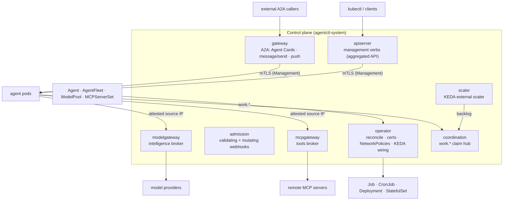

# agentctl

**A Kubernetes control plane for fleets of conformant AI agents.** agentctl
provisions, configures (intelligence, tools, instructions), scales, observes,
secures, and exposes agents — declaratively, through Custom Resources. It is
implemented in Rust.

> ### Principle P0 — depend on the *contract*, never on a specific agent
>
> agentctl consumes a published **Agent Control Contract** (`contract/`): a
> capabilities manifest, a management profile, a frozen metrics + exit-code
> table, a config schema, an A2A method registry, and a downward-API env
> convention. **Any** binary that emits a conformant manifest, honors the
> exit-code table, and serves the declared surfaces over mTLS HTTPS is managed
> unchanged. `agentd` is the reference implementation — the first agent to
> satisfy the contract — **not a dependency**.

---

## What you get

- **Declarative agents.** Describe an agent's run shape, intelligence, tools,
  instructions, and exposure in a single `Agent` resource; the operator renders
  the right Kubernetes workload and reconciles it.
- **Secret-free by construction.** Agents never hold a model-provider or
  tool-server credential. Gateways attest the caller and inject credentials
  off-pod, then meter and budget every call.
- **Fleets that scale from zero.** An `AgentFleet` is an autoscaled worker pool —
  elastic *claim* fleets (KEDA-driven from the work backlog) or fixed-partition
  *shard* fleets — optionally fronted by a coordinator "main agent".
- **A2A mesh.** Every agent and fleet is an authenticated agent-to-agent
  endpoint with a signed Agent Card, `message/send` + streaming, and push
  webhooks.
- **Cryptographic identity, hostile-multi-tenant defaults.** mTLS inbound,
  attested source-IP outbound, hardened pods, per-namespace NetworkPolicies, an
  admission allow-list, and a lethal-trifecta opt-in gate.

---

## Architecture

agentctl is a set of Deployments (eight container images) that turn Custom
Resources into managed agent workloads and broker every privileged interaction
those workloads have with the outside world.



### Components

| Component | Role |
|---|---|
| **operator** | Reconciles `Agent`/`AgentFleet` into workloads; leader-elected for HA; issues per-workload serving certificates and distributes the cluster CA; reconciles per-namespace agent NetworkPolicies; wires the KEDA `ScaledObject` for claim fleets; projects status; drives the guarded shard-resize choreography. |
| **apiserver** | A Kubernetes aggregated API that serves management verbs (drain, lame-duck, cancel, pause, resume) under `management.agentctl.dev`; authorizes each via `SubjectAccessReview`; dials the target agent pod(s) over mTLS. Fleet verbs fan out to all replicas. |
| **admission** | A validating webhook (image-registry allow-list, lethal-trifecta gate, `ModelPool` existence, OIDC-policy well-formedness) and a mutating webhook (secure defaults: labels, mode, minimal surfaces). |
| **gateway** | The public A2A surface: projects and signs each agent's/fleet's Agent Card, serves `message/send` and `message/stream` (SSE), persists tasks, delivers SSRF-guarded push webhooks, and enforces inbound auth. Reaches agents by dialing the pod over mTLS as the **Management** origin. |
| **modelgateway** | The intelligence broker: attests the caller, selects the `ModelPool`, injects the pool's provider credential, forwards to the provider, meters tokens, and enforces budgets with an atomic reserve→reconcile. |
| **mcpgateway** | The tools broker: attests the caller, scopes the call to the agent's bound `MCPServerSet`, injects each server's credential off-pod, and forwards MCP. |
| **coordination** | The work-distribution backbone — an MCP server exposing `work.*` (submit, claim, renew, ack, release, stats, result, deadletter) with exactly-one-owner claim leasing, a result/correlation channel, dead-lettering, and an in-memory or durable-Postgres store. Its backlog is the scale-from-zero signal. |
| **scaler** | A KEDA external scaler that reads the coordination backlog so claim fleets scale from zero. |

### Planes

Each capability is a *plane* built on the components above.

| Plane | Built on | What it does |
|---|---|---|
| **Provisioning** | operator + CRDs | Renders and reconciles agents into workloads. |
| **Intelligence** | modelgateway + `ModelPool` | Secret-free, metered, budgeted model access. |
| **Tools** | mcpgateway + `MCPServerSet` | Secret-free, scoped MCP tool access. |
| **Scaling** | coordination + scaler + KEDA | Elastic claim fleets; StatefulSet partitioning for shard fleets. |
| **A2A** | gateway | Agents and fleets as authenticated A2A endpoints; agent-to-agent delegation. |
| **Management** | apiserver | drain / lame-duck / cancel / pause / resume via `kubectl`, RBAC-gated. |
| **Observability** | every component + agent | Prometheus `/metrics`, scraped directly; OTLP tracing when configured. |

---

## Custom Resources

All CRDs live in the API group `agentctl.dev/v1alpha1`.

| Kind | Short names | Purpose |
|---|---|---|
| **Agent** | `agent`, `agents` | One agent workload. |
| **AgentFleet** | `afleet`, `afleets` | A replicated, autoscaled set — with optional coordinator + work-fabric orchestration. |
| **ModelPool** | `mp` | A pool of model access for the intelligence plane. |
| **MCPServerSet** | `mcpset` | A reusable bundle of MCP tool servers for the tools plane. |

### Agent

| Field | Meaning |
|---|---|
| `mode` | `once` / `loop` / `reactive` / `schedule` / `workflow`. Determines the rendered workload. |
| `image` | The conformant-agent image to run. |
| `instruction` | The agent's task instruction (required for non-reactive modes). |
| `modelPool` | The `ModelPool` this agent binds for model access (admission-validated). |
| `mcpServerSetRefs` | The `MCPServerSet`s whose tools the agent may call. |
| `subscribe` / `loop` / `schedule` / `workflow` | Mode-specific inputs (reactive subscriptions, loop cadence, cron, workflow graph). |
| `surfaces` | Which control-plane surfaces to expose: `management`, `metrics`, `a2a`. |
| `access` | A2A access policy: `public` (intent) and `oidc` (JWT verification + claim-based authz). |
| `limits` | Per-agent budgets (`maxTokens`, `maxDepth`, `maxSteps`, `treeTokenBudget`). |
| `exec` / `egress` / `secrets` | Declared privileged capabilities. Together they form the **lethal trifecta** the admission webhook gates. |

**Rendered workload by mode:** `once` and `workflow` → **Job**; `schedule` →
**CronJob**; `loop` and `reactive` → **Deployment**.

### AgentFleet

| Field | Meaning |
|---|---|
| `template` | The per-replica **worker** `AgentSpec`. |
| `scaling.mode` | `claim` (elastic, KEDA) or `shard` (fixed partitions). |
| `scaling.min` / `max` | Claim-mode replica range (may scale to 0). |
| `scaling.shards` | Shard-mode fixed partition count `N`. |
| `scaling.target` | Claim-mode autoscaling signal (e.g. `pending_events`) and per-replica target value. |
| `workSource` | The shared work source the workers claim from. |
| `coordinator` | An optional **main agent** — its own `AgentSpec`, `replicas`, and `distribution` (`queue` or `a2a`). Renders an additional Deployment and becomes the fleet's A2A front door + work producer. |
| `budget.maxTokens` | Per-fleet model budget, enforced *in addition to* the pool budget. |
| `workPolicy` | Work-fabric policy: dead-letter threshold `maxAttempts` and lease TTL `claimTtlMs`. |

**Rendered workload by scaling mode:** `claim` → a **Deployment** (KEDA owns
replicas, elastic from zero); `shard` → a **StatefulSet** of `N` fixed hash
partitions. A `coordinator`, when set, renders an additional Deployment.

### ModelPool

| Field | Meaning |
|---|---|
| `provider` / `endpoint` | Provider id and base URL. |
| `credentialSecretRef` | `{name, key}` of the `Secret` holding the provider API key. The gateway injects it; the agent never sees it. |
| `models` / `defaultModel` | Allowed model ids and the default. |
| `budget.maxTokens` | Total token budget for the pool, enforced by the modelgateway. `status.usedTokens` is the running meter. |

### MCPServerSet

Each entry in `servers[]` names a remote MCP server:

| Field | Meaning |
|---|---|
| `name` / `endpoint` | Server name and its remote MCP URL. The agent dials the gateway, never this endpoint. |
| `auth` | How the gateway authenticates upstream: `mode` (`none` or `staticToken`), `tokenSecretRef`, optional `header`. The credential lives in a `Secret` at the gateway, never on the pod. |
| `tags` | Per-server trifecta capability tags. |
| `budget.maxTokens` | Optional per-server call budget. |

---

## Quickstart

This walks a local `kind` cluster from empty to a running `Agent` and
`AgentFleet` using the bundled mock agent + mock provider.

### 1. Prerequisites

**cert-manager** is the only hard prerequisite — it issues every serving/mTLS
certificate and injects the CA bundles.

```console
kubectl apply -f https://github.com/cert-manager/cert-manager/releases/latest/download/cert-manager.yaml
kubectl -n cert-manager rollout status deploy/cert-manager-webhook
```

Optional, feature-gated dependencies (all default **off**):

| Dependency | Needed for |
|---|---|
| **KEDA** | Claim-fleet autoscaling (`scaler.enabled` — elastic from zero). |
| A **NetworkPolicy-capable CNI** (Calico/Cilium) | Tenant isolation (`networkPolicies.enabled`; kindnet ignores policies). |
| **Postgres** | Durable coordination/task/usage state. Bundled by the chart; in-memory is the single-replica default. |

### 2. Install the control plane

Pre-create the namespace (Helm cannot own the namespace it installs into) with
the `baseline` PodSecurity level, then install the chart:

```console
kubectl create namespace agentctl-system
kubectl label  namespace agentctl-system \
  pod-security.kubernetes.io/enforce=baseline \
  pod-security.kubernetes.io/warn=baseline

helm install agentctl ./charts/agentctl -n agentctl-system
```

Verify:

```console
kubectl -n agentctl-system get pods                        # all components Running
kubectl -n agentctl-system get certificate                 # all READY=True
kubectl get apiservice v1alpha1.management.agentctl.dev  # AVAILABLE=True
```

A default install brings up the **core** control plane (no dependency beyond
cert-manager): `operator`, `apiserver`, `gateway`, `modelgateway`, `mcpgateway`,
`admission`, and bundled `postgres`. The `coordination` and `scaler` planes are
opt-in — enable them (and install KEDA) for elastic claim fleets:

```console
helm upgrade agentctl ./charts/agentctl -n agentctl-system --reuse-values \
  --set coordination.enabled=true --set scaler.enabled=true   # needs KEDA
```

> Chart internals, values, and production notes live in
> [`charts/agentctl/README.md`](charts/agentctl/README.md).

### 3. Your first Agent

Give the agent a `ModelPool` to bind (the modelgateway holds the provider
credential; the agent stays secret-free), then run a one-shot agent against it.
The bundled examples wire a mock provider end-to-end:

```console
kubectl apply -f deploy/examples/mock-provider.yaml    # a stand-in model provider
kubectl apply -f deploy/examples/modelpool-mock.yaml   # ModelPool + provider Secret
```

```console
kubectl apply -f - <<'EOF'
apiVersion: agentctl.dev/v1alpha1
kind: Agent
metadata:
  name: summarizer
  namespace: default
spec:
  mode: once
  image: ghcr.io/agentd-dev/agentd:1.0.0
  instruction: "Read /data/report.md and write a 3-bullet summary to /data/summary.md"
  modelPool: mockpool
EOF

kubectl get agents
# NAME         MODE   READY   PHASE   AGE
# summarizer   once   ...     ...     10s
```

The operator renders `summarizer` to a Job, issues its serving certificate, and
projects the agent's live capabilities into `Agent.status`.

### 4. Your first AgentFleet

A claim-mode fleet is an elastic worker pool that pulls from a work source:

```console
kubectl apply -f - <<'EOF'
apiVersion: agentctl.dev/v1alpha1
kind: AgentFleet
metadata:
  name: workers
  namespace: default
spec:
  template:
    mode: reactive
    image: ghcr.io/agentd-dev/agentd:1.0.0
    subscribe: ["queue://jobs"]
    modelPool: mockpool
  scaling:
    mode: claim
    min: 0
    max: 10
    target:
      signal: pending_events
      value: "5"
  workSource: "queue://jobs"
EOF

kubectl get afleets
# NAME      SCALING   DESIRED   READY   AGE
# workers   claim     ...       ...     10s
```

The operator renders a Deployment whose replica count is owned by KEDA (elastic
from zero) when the `coordination` + `scaler` planes are enabled; without them
the fleet still reconciles, and the operator records a status condition rather
than failing the workload. More manifests live in
[`deploy/examples/`](deploy/examples/).

---

## Capabilities

### Secret-free, budgeted intelligence

Agents dial the **modelgateway** keyless. The gateway attests the caller by its
pod source IP, resolves the bound `ModelPool`, injects the pool's provider
credential (held in a `Secret` the agent never mounts), forwards to the provider,
and meters tokens. Budgets are enforced with an atomic reserve→reconcile that
holds the cap under concurrency — pool-wide, and per-fleet when an `AgentFleet`
sets its own `budget`.

### Secret-free, scoped tools

The **mcpgateway** is the tools-plane analog. It attests the caller, scopes the
call to the servers of the `MCPServerSet`s the agent binds, injects each server's
credential off-pod, and forwards MCP. The agent dials the gateway, never the
remote tool server.

### Elastic claim fleets and fixed shard fleets

- **Claim fleets** render a Deployment. Workers pull from the shared work source
  over the `work.*` fabric with exactly-one-owner leasing; the coordination
  backlog drives KEDA to scale the pool elastically, including from zero.
- **Shard fleets** render a StatefulSet of `N` fixed hash partitions. Changing
  `N` is a guarded, stop-the-world rebalance the operator choreographs.

### Fleet orchestration: a coordinator + the work fabric

A fleet can be a **main agent + workers** system. A `coordinator` decomposes a
request and fans subtasks to the elastic worker pool over the work fabric
(default) or via A2A delegation. The fabric carries results end to end:
`work.submit` returns a work id, `work.ack` records a result, `work.result`
correlates the outcome, and a poison item is **dead-lettered** after
`workPolicy.maxAttempts` redeliveries (surfaced for requeue or drop). The whole
fleet is one addressable A2A endpoint — the coordinator is the front door, else
the gateway load-balances across workers with task affinity.

### The A2A mesh

The **gateway** projects and JWS-signs an Agent Card for every agent and fleet,
and serves `message/send` and `message/stream` (SSE), persisting tasks and
delivering SSRF-guarded push webhooks. Inbound auth is per-agent: OIDC/JWT with
claim-based authorization (`access.oidc`), a trusted-proxy mTLS identity, or a
coarse bearer token. The gateway reaches agents by dialing the pod over mTLS,
presenting the control-plane client certificate — the **Management** origin.

### The security model

Identity is cryptographic:

- **Inbound to an agent** — a verified mTLS client certificate authenticating the
  caller as the **Management** origin, the only origin allowed to drive
  management/A2A on the agent.
- **Outbound from an agent** — the agent's **attested source IP** (its pod IP,
  resolved to the pod via the Kubernetes API). Confined tenant pods cannot spoof
  it, so one tenant cannot bill or borrow another's pool.
- **Secret-free agents** — agents never hold a provider or tool credential; the
  gateways inject credentials off-pod.
- **Hardened pods** — nonroot, no privilege escalation, all capabilities
  dropped, read-only root filesystem, no auto-mounted ServiceAccount token,
  restricted PodSecurity.
- **Tenant isolation** — default-deny NetworkPolicies (egress only to DNS and the
  control-plane gateways; ingress only from the control-plane namespace), shipped
  by the chart and reconciled per-namespace by the operator.
- **Admission** — an image-registry allow-list, plus a gate that requires an
  explicit annotation before an agent may hold the **lethal trifecta**
  (`exec` + `egress` + `secrets` together).
- **PKI + RBAC** — all control-plane TLS is issued by cert-manager; management
  access is RBAC-gated via `SubjectAccessReview`.

See [`docs/security.md`](docs/security.md) for the full model.

### Observability

Every component and agent exposes a Prometheus `/metrics` endpoint, scraped
directly (`agentctl_operator_*`, `agentctl_gateway_*`, `agentctl_modelgateway_*`,
`agentctl_admission_*`, and the agents' `agent_*` series). The chart can emit
`ServiceMonitor`s, a Grafana dashboard, and a `PrometheusRule` (all off by
default). OTLP tracing is emitted when configured.

---

## Documentation

| Doc | What's in it |
|---|---|
| [docs/use-cases.md](docs/use-cases.md) | Worked examples — startup, small business, AI engineer, platform/data/ops — with apply-ready `agentd` manifests. |
| [docs/architecture.md](docs/architecture.md) | Component topology and per-flow sequence diagrams. |
| [docs/security.md](docs/security.md) | Identity, isolation, the trifecta gate, and the PKI. |
| [docs/operations.md](docs/operations.md) | Day-2 operations: management verbs, upgrades, tuning. |
| [docs/benchmarks.md](docs/benchmarks.md) | Throughput, latency, and density measurements. |
| [contract/README.md](contract/README.md) | The Agent Control Contract — how any agent conforms. |
| [charts/agentctl/README.md](charts/agentctl/README.md) | Helm chart values, install options, and production notes. |

---

## License

This repository is dual-licensed **by component**; [`LICENSE`](LICENSE) is the
authoritative map.

- **Apache-2.0** — the contract (`contract/`), the SDK/libraries, and the client
  tooling. The standard and SDK are open so any agent vendor can implement and
  build on them (P0).
- **Business Source License 1.1** — the runnable control plane. Source-available:
  free for non-production and internal non-commercial use; commercial production
  or managed-service use requires a commercial license until the Change Date
  (2030-06-28), when each version converts to Apache-2.0. See
  [`LICENSE-BUSL`](LICENSE-BUSL).

Commercial licensing: andrii@tsok.org. Contributions are under the [CLA](CLA.md).
