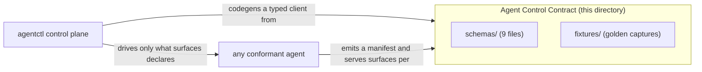

# Agent Control Contract (ACC)

The **Agent Control Contract (ACC)** is the language-neutral, machine-readable contract that
[agentctl](../README.md) — the Kubernetes control plane for fleets of AI agents — consumes, and that
**any conformant agent** implements. It is published as a set of JSON Schemas (draft 2020-12), frozen
data catalogues, and golden fixtures. This document is the overview and the guide to conforming; the
normative, field-by-field surface lives in [`SPEC.md`](SPEC.md).

The contract version is **2.0** (see [`VERSION`](VERSION)).

---

## The core principle

**agentctl depends on this contract, never on a specific agent implementation.** Any binary that
emits a conformant capabilities manifest, honors the frozen exit-code table, serves the surfaces it
declares, and speaks the declared wire protocols is a conformant agent that agentctl can provision,
scale, observe, secure, and expose — unchanged.

`agentd` is the *reference* implementation: the first agent to satisfy the ACC. It is not privileged.
The contract defines only **vendor-neutral tokens**, so any agent — in any language — can implement it.



---

## The neutral tokens

The contract uses one neutral spelling for every wire token, so no vendor name is load-bearing.

| Concern | Neutral (canonical) token |
|---|---|
| Downward-API env prefix | `AGENT_*` |
| URI scheme | `agent://` |
| Metric name prefix | `agent_` |
| Manifest version key | `agent_version` (required at the manifest root) |
| `_meta` namespace | `agent/*` |
| Capabilities entrypoint | `--capabilities` (the flag is neutral; the binary name is implementation-specific) |

An agent may keep its own aliases internally, but the neutral tokens above are what the schemas
require and what agentctl codegens against.

---

## The artifacts

`schemas/` is the single canonical set. Every `$id` is `https://agentctl.dev/contract/v1/<file>` —
the `v2` there is the contract major version, not a directory — and every `$ref` is file-internal
(`#/$defs/...`) so the set resolves standalone.

```
contract/
  VERSION                        # the contract version: 2.0
  README.md                      # this file — overview + how to conform
  SPEC.md                        # the normative, field-by-field surface
  schemas/
    manifest.schema.json         # capabilities manifest — the discovery spine
    config.schema.json           # the declarative agent config file
    report.schema.json           # the run-outcome report
    events.schema.json           # the agent://events live event-stream body
    metrics.registry.json        # frozen Prometheus metrics registry (metrics_schema 1.0)
    a2a.methods.json             # A2A method set + core wire types
    exit-codes.table.json        # frozen exit-code table
    management-profile.json      # operator methods, agent:// resources, PeerOrigin gating
    env-convention.json          # the downward-API env-var convention
  fixtures/
    capabilities/
      default.json               # real --capabilities capture: once mode, listeners off
      full-features.json         # real --capabilities capture: reactive, mTLS HTTPS, surfaces on
      reference-full.json        # synthetic full-feature manifest
      minimal-degraded.json      # synthetic all-surfaces-off manifest
```

### Two categories of artifact

The nine schema files fall into two categories that must not be confused:

- **Document validators** — `manifest.schema.json`, `config.schema.json`, `report.schema.json`, and
  `events.schema.json` validate an instance (a manifest, a config file, a report, an events body).
- **Data catalogues** — `metrics.registry.json`, `a2a.methods.json`, `exit-codes.table.json`,
  `management-profile.json`, and `env-convention.json` are draft-2020-12 envelopes wrapping **frozen
  reference data** (registries and tables). They carry `$schema`/`$id`/`title` and pass the
  metaschema, but their payload is codegen input, not an instance validator. In particular,
  Prometheus `/metrics` output is **text**, not JSON — do not validate it against
  `metrics.registry.json`.

---

## What conformance means

A conformant agent is conformant by **behavior**, not by sharing code with the reference. Shape is
necessary but not sufficient: a binary that parses but misbehaves (for example, a "clean drain" that
exits non-zero) is non-conformant. To self-certify:

1. **Emit a capabilities manifest** from the one-shot `--capabilities` entrypoint that validates
   against [`schemas/manifest.schema.json`](schemas/manifest.schema.json), declaring
   `contract_version`, `agent_version`, and an honest [`surfaces{}`](SPEC.md#4-the-capabilities-manifest)
   block. The live `agent://capabilities` resource must be semantically equal to the one-shot output.

2. **Honor the frozen exit-code table** ([`schemas/exit-codes.table.json`](schemas/exit-codes.table.json))
   and, for a bounded run, write a run-outcome report that validates against
   [`schemas/report.schema.json`](schemas/report.schema.json).

3. **Serve each declared surface** to its schema. For every key you report as served in `surfaces{}`,
   serve the matching surface: management methods and `agent://` resources
   ([`management-profile.json`](schemas/management-profile.json)), metrics
   ([`metrics.registry.json`](schemas/metrics.registry.json)), A2A
   ([`a2a.methods.json`](schemas/a2a.methods.json)), config validation
   ([`config.schema.json`](schemas/config.schema.json)), and the `agent://events` stream
   ([`events.schema.json`](schemas/events.schema.json)).

4. **Honor the downward-API env convention** ([`env-convention.json`](schemas/env-convention.json))
   and the `agent://` resource naming.

5. **Serve your control surface over mTLS HTTPS.** A conformant agent exposes its management/A2A
   surface at `POST /mcp` over mutual TLS and dials the control-plane gateways with no embedded
   credentials. Identity is cryptographic — see [Security model](#security-model).

The golden fixtures in `fixtures/capabilities/` are the validation ground-truth. `default.json` and
`full-features.json` are **real captures** from the reference `agentd` binary (both carry
`agent_version` `1.0.0`) and together exercise both branches of every sum-type surface key.

---

## Version negotiation

`contract_version` is **`major.minor`** (reference `"2.0"`). Every version key in the contract follows
the same discipline:

- **Additive growth bumps MINOR.** New manifest fields, new `surfaces{}` keys, new operator methods,
  new metrics, and new config keys are additive. A consumer **must tolerate** them: every open object
  is `additionalProperties: true` and every enum-like array is open strings, not a closed enum.
- **A breaking change bumps MAJOR.** Removing, renaming, or narrowing a field, changing a sum-type
  shape, or breaking a frozen table is breaking. A consumer **refuses only an unknown MAJOR** and,
  within a known major, accepts any unknown additive content.

`surfaces{}` is the **single discovery point**. Each control-plane surface is reported honestly as
served-or-not for *this* build and config. **A key absent means the surface is unbuilt, so the
consumer degrades gracefully** — absence is never an error, and agentctl drives only what is declared.
Never branch on `build_features`; it is opaque diagnostic metadata.

Several `surfaces{}` keys are **sum types** that code generation cannot derive; a typed client needs a
hand-written deserializer for each (this is the only hand-maintained code in the reference client,
[`crates/agent-contract-client`](../crates/agent-contract-client)):

| Key | Shape | Meaning |
|---|---|---|
| `surfaces.management` | `false \| string` | management address — an mTLS HTTPS URL (e.g. `https://0.0.0.0:8443`), else `false` |
| `surfaces.metrics` | `false \| string` | `/metrics` scrape address (e.g. `0.0.0.0:9090`), else `false` |
| `surfaces.a2a` | `false \| object{version,streaming,methods[]}` | the compiled A2A capability, else `false` |
| `surfaces.claim` | `bool \| object{styles[]}` | claim styles — **omitted when absent, never `false`** |
| `surfaces.shard` | `string \| null` | `"K/N"` shard identity, else `null` |
| `intelligence.healthy` | `bool \| "unknown"` | reachability, or `"unknown"` before the first connect |

Full negotiation rules and the three distinct encodings of "not set" are in
[`SPEC.md`](SPEC.md#2-the-cross-cutting-laws).

---

## The control surfaces at a glance

`surfaces{}` advertises these. Each is normatively specified in [`SPEC.md`](SPEC.md); how agentctl
consumes each is summarized here.

| Surface | Discovery key(s) | What the agent serves | How agentctl consumes it |
|---|---|---|---|
| **Capabilities manifest** | (always) | `--capabilities` + `agent://capabilities` | Codegens a typed client; reads `surfaces{}` to decide what to drive; projects the base Agent Card. |
| **Management (MCP profile)** | `management`, `operator_tools` | `a2a.Drain`/`a2a.LameDuck`/`a2a.Pause`/`a2a.Resume`/`a2a.Cancel` on the mTLS `POST /mcp` listener, plus `agent://` resources | The apiserver serves `drain`/`lame-duck`/`pause`/`resume`/`cancel` by invoking these methods over mTLS, RBAC-gated. |
| **A2A** | `a2a` | `SendMessage`/`GetTask`/`CancelTask`/`ListTasks` and the streaming pair over HTTPS JSON-RPC | The A2A gateway projects and signs the Agent Card, then relays `message/send` / `message/stream` to the agent over mTLS. |
| **Workflow** | `workflow` | a workflow-graph run engine; `dialect >= 2 && checkpoint` adds checkpoint/resume with an INPUT_REQUIRED gate | The gateway keeps polling/streaming across the non-terminal `INPUT_REQUIRED` state and routes a `message.taskId` gate-reply back to the member that owns the paused task (task affinity). |
| **Metrics** | `metrics`, `metrics_schema` | Prometheus `/metrics` text | Scraped directly; autoscalers read the backlog signals; dashboards and alerts are codegenned from the registry. |
| **Exit codes** | `exit_codes` | process exit codes per the frozen table | Each code's `intent` compiles into the Job `podFailurePolicy` / `onExitCodes`. |
| **Run report** | `report_schema` | `agent://run/{run_id}` and the report file | The durable backend for `kubectl agents results` after the pod is gone. |
| **Events** | `events` | `agent://events` bounded live stream | Operators tail live activity without scraping container stderr. |
| **Config** | `config_validate`, `config_schema`, `hot_reload` | `--validate-config`, `--config-schema`, SIGHUP reload | The operator renders the config from the CRD spec and validates it before rollout. |
| **Sharding / claim / standby** | `cluster`, `shard`, `claim`, `standby` | shard identity and work-claim styles | The operator wires StatefulSet partitioning (shard fleets) or KEDA-scaled claim routes (claim fleets). |

---

## Security model

Identity is cryptographic, not positional.

- **Inbound to an agent.** A caller that presents a client certificate the agent's mTLS acceptor
  **verifies against the pinned client CA** is the **Management** origin — the only origin allowed to
  drive the management and A2A methods. A request on the HTTPS listener with no verified certificate
  is unauthenticated and refused; it is never downgraded to a weaker origin. The A2A gateway relays to
  the agent under the control-plane client certificate, so gateway-forwarded work arrives as
  Management.
- **Outbound from an agent.** The agent dials its configured intelligence and tool endpoints
  **directly**, presenting **no credential from its manifest**. It either signs each request with
  its own portable identity (secret-free) or presents a credential supplied out-of-band on the
  `AGENT_*_TOKEN[_FILE]` env path — there is no off-pod broker injecting credentials.
- **Secret-freedom is structural.** The manifest never carries a credential; the config file carries
  only `{{secret:NAME}}` / `{{secret-file:PATH}}` references; credentials travel only the
  `AGENT_*_TOKEN[_FILE]` env path.

The full trust model — the closed `{Stdio, Management}` PeerOrigin set and what each may invoke — is
in [`SPEC.md`](SPEC.md#5-the-mcp-management-profile).

---

## How agentctl consumes the contract

agentctl generates a typed `agent-contract-client` from these schemas. The reference client lives at
[`crates/agent-contract-client`](../crates/agent-contract-client). The load-bearing codegen notes:

1. **Point the resolver at `schemas/`** — the single canonical set, every `$id` unified.
2. **Hand-write the sum-type deserializers** for `management`, `metrics`, `a2a`, `claim`, `shard`, and
   `intelligence.healthy`; codegen cannot derive their `oneOf` discriminations.
3. **Tolerate unknown additive content** — open objects, unknown surface keys, unknown operator
   methods, unknown metrics — and refuse only an unknown `contract_version` MAJOR.
4. **Target the neutral spellings** and treat `build_features` as opaque diagnostic metadata; branch
   on `surfaces{}` alone.

---

See [`SPEC.md`](SPEC.md) for the normative surface: the cross-cutting laws, the capabilities manifest,
the MCP management profile, A2A over HTTPS, the frozen metrics and exit-code catalogues, the report
and event schemas, the config schema, and the env convention.
