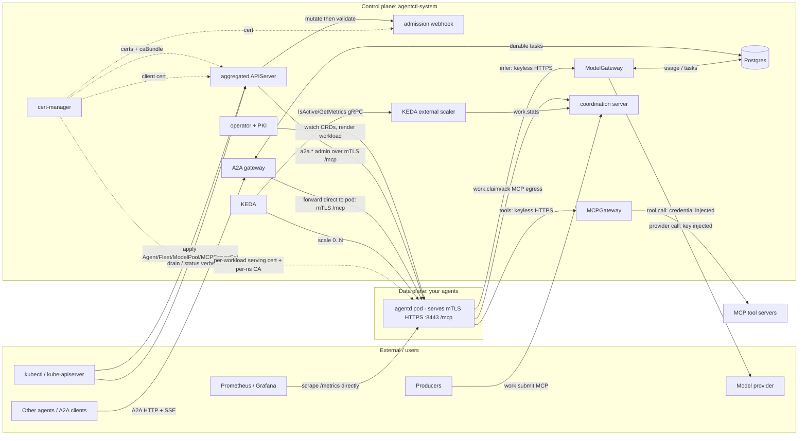
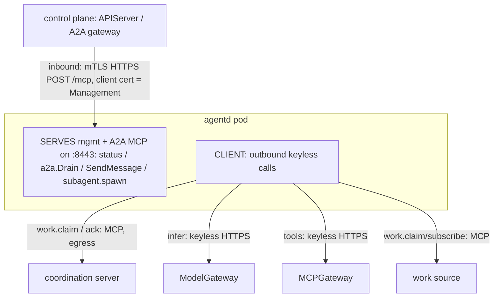
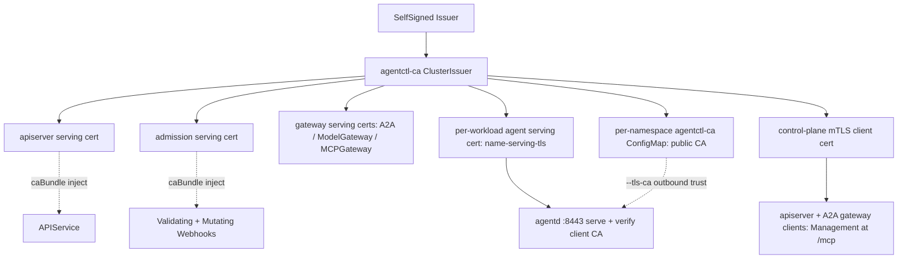
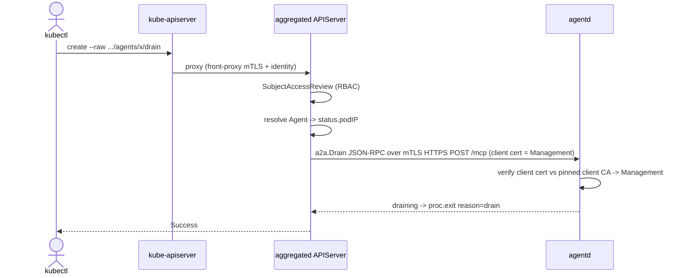
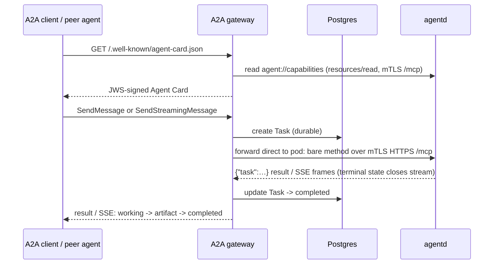
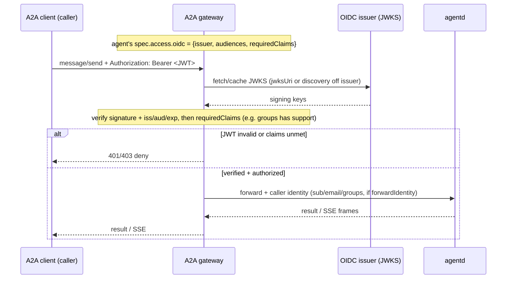
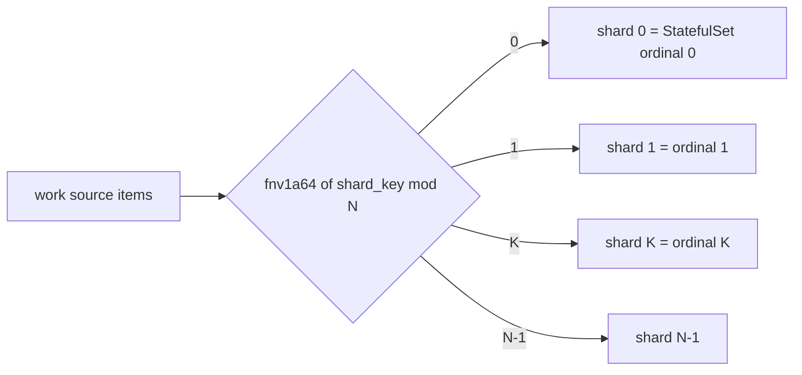
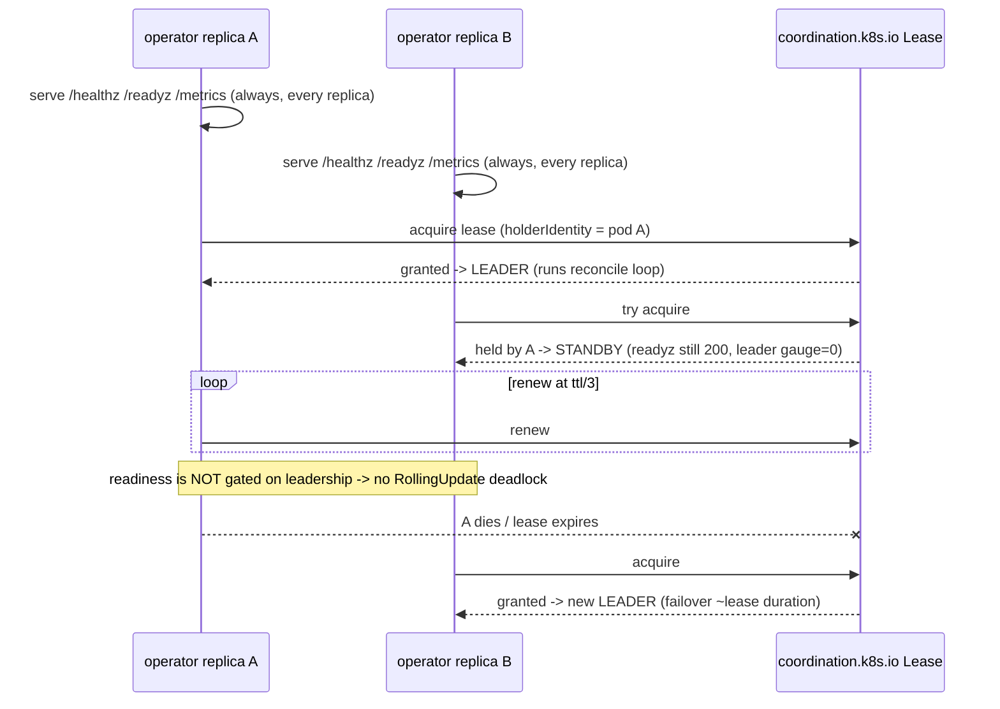

# agentctl — architecture & wiring

How the control-plane components and the data-plane agents (e.g. `agentd`) are
connected and communicate. Each diagram is one slice of the system; together they
show the whole wiring.

> ⚠️ **Contract 2.0 — the network is the substrate.** These diagrams reflect the
> **v2** model: agents **serve mTLS HTTPS** (`POST /mcp`) and **dial the gateways
> keyless**; the **node-agent is retired** (no host socket, no on-node bridge);
> identity is cryptographic — a verified mTLS **client cert** into agents, an
> **attested source IP** into the gateways. See
> **[RFC 0021](../rfcs/0021-contract-2.0-network-substrate-pivot.md)** for the full design.

**Legend:** solid = request/data path · dashed = certificates / out-of-band ·
`agentd` = any conformant agent (the data plane). The control plane is Rust; the
data plane is *any* agent that speaks the Agent Control Contract (ACC).

See also: [STATUS](STATUS.md) · [operations runbook](operations.md) ·
[cloud-native roadmap](cloud-native-roadmap.md).

---

## 1. Component topology — who talks to whom



---

## 2. An agent's two MCP directions

An agent **serves** a management profile (the control plane drives it) and is a
**client** for work + intelligence + sources (it reaches out). These are opposite
directions and easy to conflate.



---

## 3. Trust: cert-manager issuance + caBundle injection



A self-signed bootstrap issuer mints the **`agentctl-ca` ClusterIssuer** (one cluster
CA); it mints every serving/mTLS leaf — including a **per-workload serving cert**
(`<name>-serving-tls`) for each agent — and the control plane's client cert. A
**per-namespace `agentctl-ca` ConfigMap** distributes the public CA so agents trust
the gateways' serving certs (`--tls-ca`). cert-manager's cainjector populates the
`caBundle` on the APIService and webhooks; renewal is automatic (`renewBefore`), and
agentd **hot-reloads its serving cert** on rotation without a restart.

---

## 4. Provisioning — apply a CR → running agent

```mermaid
sequenceDiagram
  actor U as kubectl
  participant API as kube-apiserver
  participant ADM as admission webhook
  participant OP as operator
  participant AG as agentd pod
  U->>API: apply Agent (image, mode, modelPool, caps)
  API->>ADM: mutate (defaults) then validate (trifecta + registry)
  ADM-->>API: patched + admitted
  OP->>API: watch Agents
  OP->>OP: ensure per-workload PKI (serving cert + per-ns CA ConfigMap)
  OP->>API: apply Deployment/Job/StatefulSet (restricted-PSS + downward env + TLS mounts, zero pod creds)
  API-->>AG: scheduled + started
  AG->>AG: serve mgmt + A2A MCP on mTLS HTTPS :8443; idle / reactive
```

---

## 5. Management path — kubectl drain



The verbs `drain` / `lame-duck` / `cancel` / `pause` / `resume` map to
`a2a.Drain` / `a2a.LameDuck` / `a2a.Cancel` / `a2a.Pause` / `a2a.Resume`. Each stays
SAR-gated at the APIServer; the call goes **direct to the agent pod** — no node-agent,
no host socket, no `pods/proxy`.

---

## 6. Intelligence path — secretless + budgeted

```mermaid
sequenceDiagram
  participant AG as agentd
  participant MG as ModelGateway
  participant K8 as kube Secret via ModelPool
  participant P as Provider
  Note over AG: secretless — dials AGENT_INTELLIGENCE=https://…modelgateway… keyless
  AG->>MG: infer over TLS (no key, no identity header)
  MG->>MG: attest caller by SOURCE IP (kube pod lookup) -> namespace/identity
  MG->>K8: read ModelPool credentialSecretRef
  MG->>MG: meter tokens; check budget
  alt within budget
    MG->>P: provider call (real key injected)
    P-->>MG: completion + usage
    MG-->>AG: completion
  else over budget
    MG-->>AG: HTTP 429
  end
```

### 6a. Source-IP attestation & the cold-start race

Contract 2.0 makes every agent network-native, so the ModelGateway (and the MCPGateway)
attest the caller **by source IP** directly — the v1 node-agent infer-proxy forwarder is
**retired**. The gateway maps the TCP source IP to the calling pod via a kube watch-cache,
deriving the agent's namespace/identity; a header is never trusted, and a confined pod
drops `CAP_NET_RAW` so it cannot spoof its source IP. The one hazard is a **cold-start
race** — an agent may dial before its `status.podIP` has propagated into the gateway's
watch-cache — handled by a bounded retry.

```mermaid
sequenceDiagram
  participant AG as agentd (routable pod IP)
  participant MG as ModelGateway / MCPGateway
  participant KW as kube watch-cache (pods by IP)
  AG->>MG: infer / tool call over TLS (keyless; source IP = pod IP)
  MG->>KW: resolve source IP -> pod
  alt pod not yet in cache (cold start)
    MG->>MG: retry 3x / 500ms
  end
  KW-->>MG: pod -> namespace / identity
  MG->>MG: scope + inject credential + meter + budget
  MG-->>AG: response
```

---

## 7. A2A path — agents reachable by other agents



The gateway forwards **direct to the agent pod** with the contract-2.0 wire (bare
PascalCase methods, `{"task"}` envelope, SSE terminated by terminal state + close);
there is no node-agent relay. Durable history + push config stay gateway-owned.

### 7a. OIDC-gated A2A request — per-agent caller identity

When an `Agent` declares `spec.access.oidc` (see security.md), the gateway gates the
A2A surface on a JWKS-verified JWT + required-claims authz before forwarding, and
passes the verified identity to the agent.



### 7b. Trusted front-proxy A2A request — edge auth at an external API gateway

When `trustedProxy.enabled` is set, a fronting API gateway (e.g. APISIX) terminates edge auth
and asserts the identity over an **mTLS channel**. The A2A gateway authenticates the *proxy*
(client cert vs the agentctl CA + an `allowedNames` list), trusts the asserted
`<prefix>-subject/-email/-groups` (prefix `trustedProxy.headerPrefix`, default `x-agentctl`),
**strips** those headers from any untrusted plaintext caller, enforces the
agent's `requiredClaims`, and forwards the identity to the agent. Mirrors the
aggregated-apiserver front-proxy. See security.md → "Trusted front-proxy (external API gateway)".

```mermaid
sequenceDiagram
  participant C as External client
  participant PX as APISIX (front-proxy)
  participant IdP as OIDC issuer
  participant GW as A2A gateway
  participant AG as agentd
  Note over PX: trustedProxy.enabled; APISIX holds a client cert from the agentctl CA
  C->>PX: request + Authorization: Bearer <JWT>
  PX->>IdP: terminate edge auth (verify JWT)
  IdP-->>PX: verified identity (sub / email / groups)
  PX->>GW: mTLS (client cert) + x-agentctl-subject/-email/-groups
  Note over GW: verify client cert vs agentctl CA; client name allow-listed?
  alt untrusted channel (plaintext / name not allow-listed)
    GW->>GW: STRIP x-agentctl-* + legacy X-Forwarded-* (anti-spoof)
    GW-->>C: 401/403 — no asserted identity honored
  else trusted proxy channel
    Note over GW: trust x-agentctl-*; enforce agent requiredClaims
    alt requiredClaims unmet
      GW-->>PX: 403 deny
    else authorized
      GW->>AG: forward + caller identity
      AG-->>GW: result / SSE frames
      GW-->>PX: result / SSE
      PX-->>C: result / SSE
    end
  end
```

---

## 8. Claim-mode work distribution — elastic from zero

```mermaid
sequenceDiagram
  participant PR as Producer
  participant CO as coordination server
  participant SC as scaler
  participant KE as KEDA
  participant FL as fleet 0..N agentd
  participant MG as ModelGateway
  PR->>CO: work.submit(item, claim_key)
  loop polling
    KE->>SC: IsActive / GetMetrics (gRPC)
    SC->>CO: work.stats -> pending
  end
  KE->>FL: scale 0 -> N (from zero)
  FL->>CO: work.claim(item) + claim_key  (N agents race)
  CO-->>FL: granted=true to ONE; held_by to the rest
  FL->>MG: infer (process the item)
  FL->>CO: work.ack(lease, claim_key)
  Note over CO: claim_key recorded -> redelivery deduped; lease expiry re-offers on crash
  SC->>CO: work.stats -> 0
  KE->>FL: scale N -> 0
```

Distribution is **pull/claim**, not push — the only "assignment" is the atomic
claim picking one winner of N racers. Producers `work.submit` references (not
payloads); the bytes live in your store.

---

## 9. Shard-mode partitioning — keyed / ordered work



`N = scaling.shards` is operator-owned (KEDA paused). The predicate runs at intake
before any claim, so out-of-shard items drop at ~zero cost. The same key always
lands on the same shard (ordering). Composes with claim for resize overlap.

---

## 10. Operator HA — leader election



---

## Cross-cutting notes

- **Two trust planes meet at the agent — identity, not reachability.** *Inbound*
  management + A2A is **direct mTLS** to the agent's `/mcp`; the agent verifies the
  caller's client cert against the pinned client CA (⇒ `Management`). *Outbound*
  intelligence + tools is the agent **dialing the gateways keyless**, attested by
  **source IP**. No node-agent, no host socket, and **no credential on the pod**.
- **State.** Postgres is shared durable state for the gateway (A2A tasks) and the
  ModelGateway (token usage); the coordination server is in-memory (the claim
  ledger), deliberately separate (and behind a `ClaimStore` trait for a future
  durable backend).
- **The contract is the boundary.** agentctl never depends on a specific agent —
  every arrow into `agentd` above is an ACC surface (management profile, A2A,
  `work.*`, the downward-API env, `/metrics`), so any conformant agent wires in
  identically.
