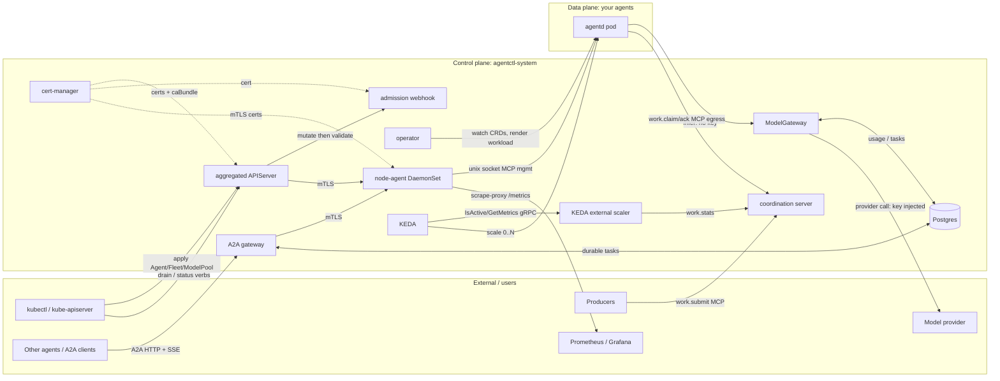
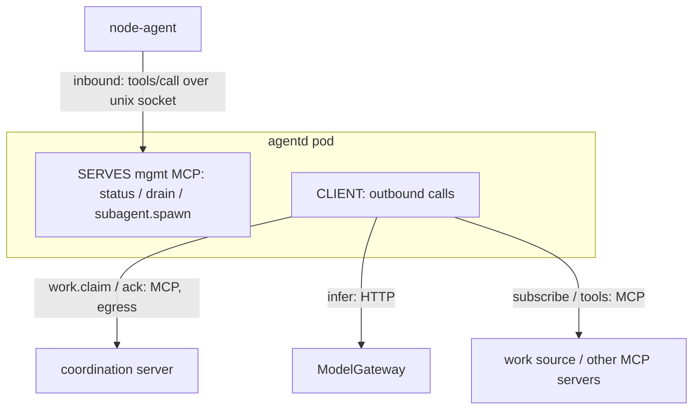
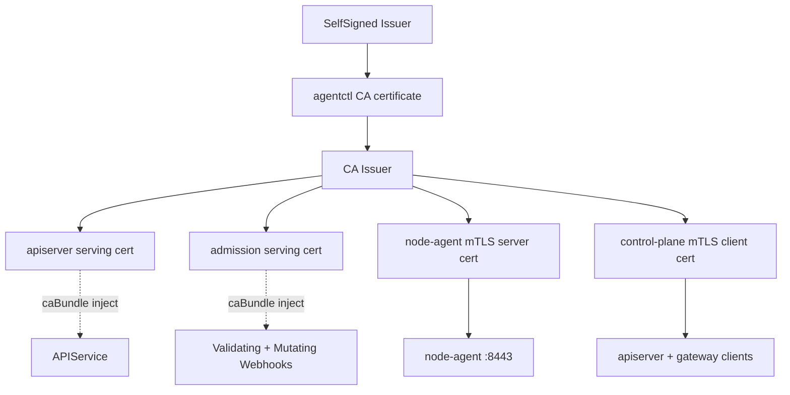
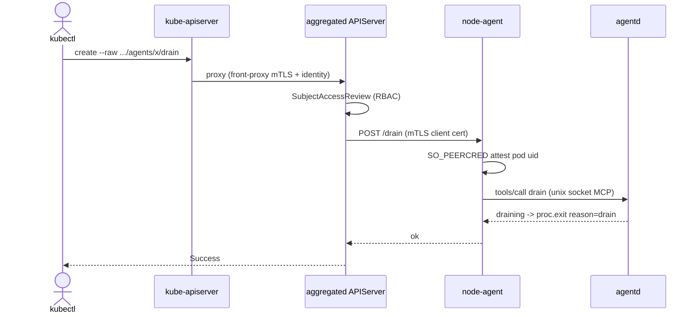
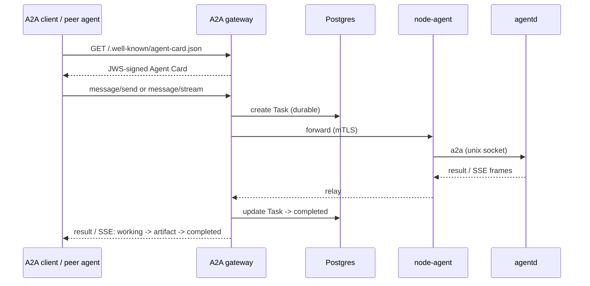
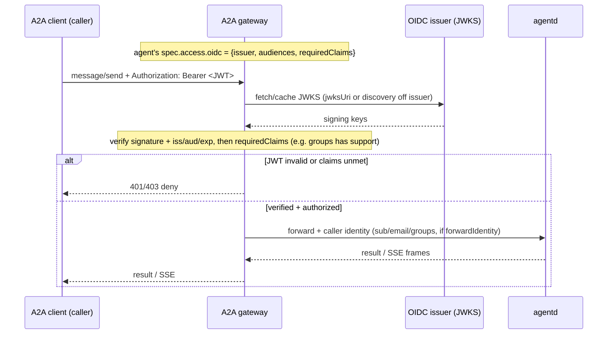
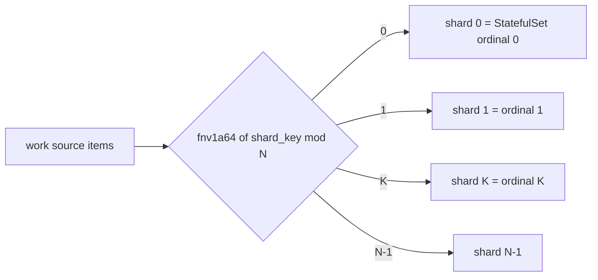
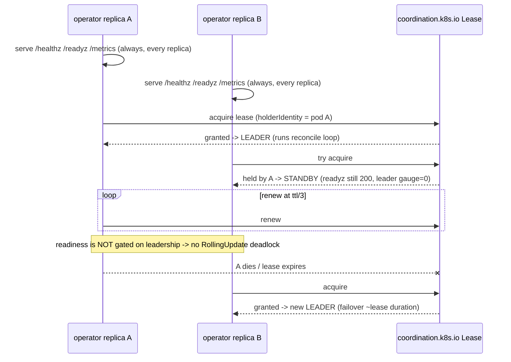

# agentctl — architecture & wiring

How the control-plane components and the data-plane agents (e.g. `agentd`) are
connected and communicate. Each diagram is one slice of the system; together they
show the whole wiring.

**Legend:** solid = request/data path · dashed = certificates / out-of-band ·
`agentd` = any conformant agent (the data plane). The control plane is Rust; the
data plane is *any* agent that speaks the Agent Control Contract (ACC).

See also: [STATUS](STATUS.md) · [operations runbook](operations.md) ·
[cloud-native roadmap](cloud-native-roadmap.md).

---

## 1. Component topology — who talks to whom



---

## 2. An agent's two MCP directions

An agent **serves** a management profile (the control plane drives it) and is a
**client** for work + intelligence + sources (it reaches out). These are opposite
directions and easy to conflate.



---

## 3. Trust: cert-manager issuance + caBundle injection



A self-signed bootstrap issuer mints the agentctl CA; the CA issuer mints every
serving/mTLS leaf; cert-manager's cainjector populates the `caBundle` on the
APIService and the webhooks. Renewal is automatic (`renewBefore`).

---

## 4. Provisioning — apply a CR → running agent

```mermaid
sequenceDiagram
  actor U as kubectl
  participant API as kube-apiserver
  participant ADM as admission webhook
  participant OP as operator
  participant AG as agentd pod
  U->>API: apply Agent (image, mode, modelPool, caps)
  API->>ADM: mutate (defaults) then validate (trifecta + registry)
  ADM-->>API: patched + admitted
  OP->>API: watch Agents
  OP->>API: apply Deployment/Job/StatefulSet (confined + downward env + mgmt socket)
  API-->>AG: scheduled + started
  AG->>AG: serve mgmt MCP on unix socket; idle / reactive
```

---

## 5. Management path — kubectl drain



---

## 6. Intelligence path — secretless + budgeted

```mermaid
sequenceDiagram
  participant AG as agentd
  participant MG as ModelGateway
  participant K8 as kube Secret via ModelPool
  participant P as Provider
  Note over AG: networkless + secretless
  AG->>MG: infer (X-Agent identity, no key)
  MG->>K8: read ModelPool credentialSecretRef
  MG->>MG: meter tokens; check budget
  alt within budget
    MG->>P: provider call (real key injected)
    P-->>MG: completion + usage
    MG-->>AG: completion
  else over budget
    MG-->>AG: HTTP 429
  end
```

### 6a. Routed-infer attestation — the networkless (Kata) tier

On the networkless tier the agent has no routable pod IP, so the ModelGateway cannot attest it
by source IP. Opt-in (`nodeAgent.inferProxy.enabled` + the operator annotation
`agentctl.dev/routed-infer: "true"`) routes inference through the node-agent's unix-socket
forwarder, which kernel-attests the peer (`SO_PEERCRED`) and re-stamps the identity so the
client cannot self-assert. See docs/security.md → "Networkless-tier infer attestation".

```mermaid
sequenceDiagram
  participant AG as agentd (networkless)
  participant NA as node-agent (infer-proxy)
  participant MG as ModelGateway
  Note over AG: AGENT_INTELLIGENCE = unix:/run/agentctl/infer/infer.sock (read-only mount)
  AG->>NA: infer over unix socket (no IP, may assert any header)
  NA->>NA: SO_PEERCRED -> /proc cgroup -> pod uid
  NA->>NA: strip client identity; re-stamp X-Agent-Pod-Uid
  NA->>MG: infer + X-Agent-Pod-Uid (trusted forwarder, source IP)
  MG->>MG: trust forwarder IP; resolve uid -> namespace/identity
  MG-->>NA: completion (metered + budgeted)
  NA-->>AG: completion
```

---

## 7. A2A path — agents reachable by other agents



### 7a. OIDC-gated A2A request — per-agent caller identity

When an `Agent` declares `spec.access.oidc` (see security.md), the gateway gates the
A2A surface on a JWKS-verified JWT + required-claims authz before forwarding, and
passes the verified identity to the agent.



---

## 8. Claim-mode work distribution — elastic from zero

```mermaid
sequenceDiagram
  participant PR as Producer
  participant CO as coordination server
  participant SC as scaler
  participant KE as KEDA
  participant FL as fleet 0..N agentd
  participant MG as ModelGateway
  PR->>CO: work.submit(item, claim_key)
  loop polling
    KE->>SC: IsActive / GetMetrics (gRPC)
    SC->>CO: work.stats -> pending
  end
  KE->>FL: scale 0 -> N (from zero)
  FL->>CO: work.claim(item) + claim_key  (N agents race)
  CO-->>FL: granted=true to ONE; held_by to the rest
  FL->>MG: infer (process the item)
  FL->>CO: work.ack(lease, claim_key)
  Note over CO: claim_key recorded -> redelivery deduped; lease expiry re-offers on crash
  SC->>CO: work.stats -> 0
  KE->>FL: scale N -> 0
```

Distribution is **pull/claim**, not push — the only "assignment" is the atomic
claim picking one winner of N racers. Producers `work.submit` references (not
payloads); the bytes live in your store.

---

## 9. Shard-mode partitioning — keyed / ordered work



`N = scaling.shards` is operator-owned (KEDA paused). The predicate runs at intake
before any claim, so out-of-shard items drop at ~zero cost. The same key always
lands on the same shard (ordering). Composes with claim for resize overlap.

---

## 10. Operator HA — leader election



---

## Cross-cutting notes

- **Two trust planes meet at the agent.** *Inbound* management is mTLS
  (apiserver → node-agent) then a kernel-attested (`SO_PEERCRED`) unix socket
  (node-agent → agent). *Outbound* work/intelligence is the agent dialing out
  (egress on the hardened/networkless tier).
- **State.** Postgres is shared durable state for the gateway (A2A tasks) and the
  ModelGateway (token usage); the coordination server is in-memory (the claim
  ledger), deliberately separate (and behind a `ClaimStore` trait for a future
  durable backend).
- **The contract is the boundary.** agentctl never depends on a specific agent —
  every arrow into `agentd` above is an ACC surface (management profile, A2A,
  `work.*`, the downward-API env, `/metrics`), so any conformant agent wires in
  identically.
