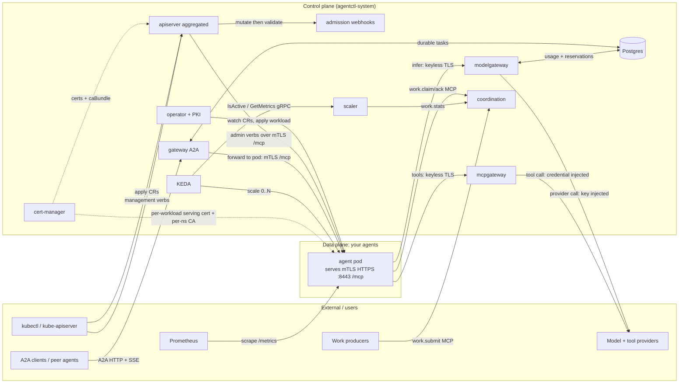
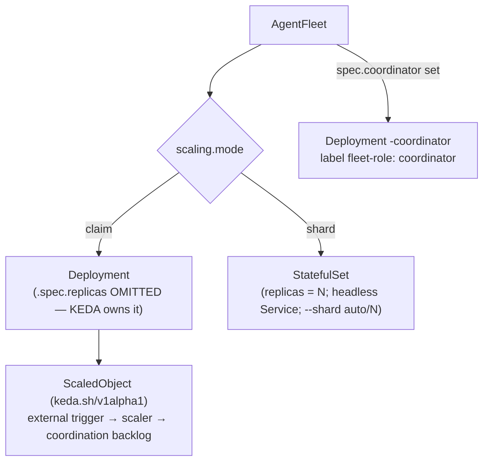
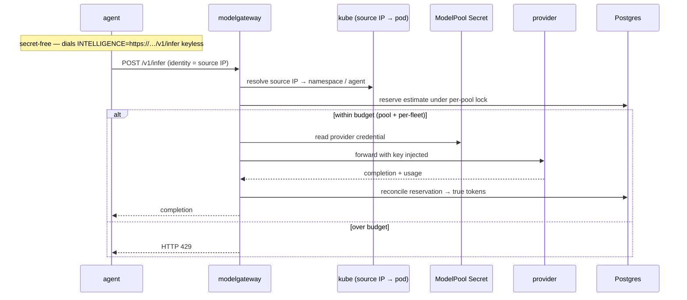
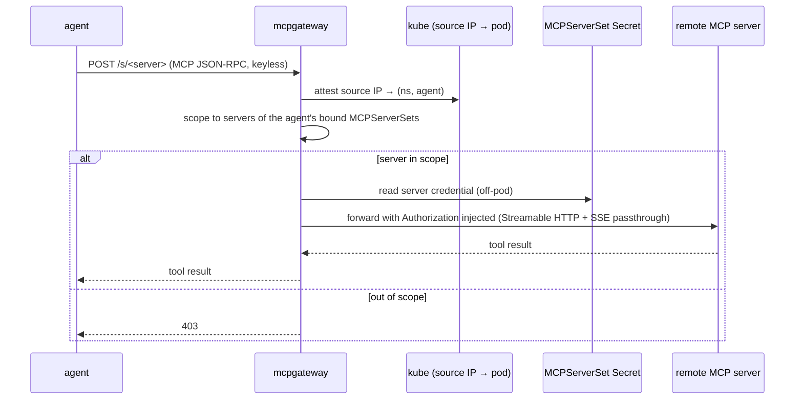
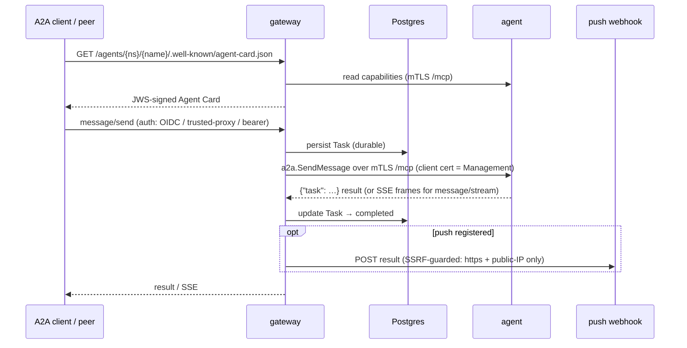
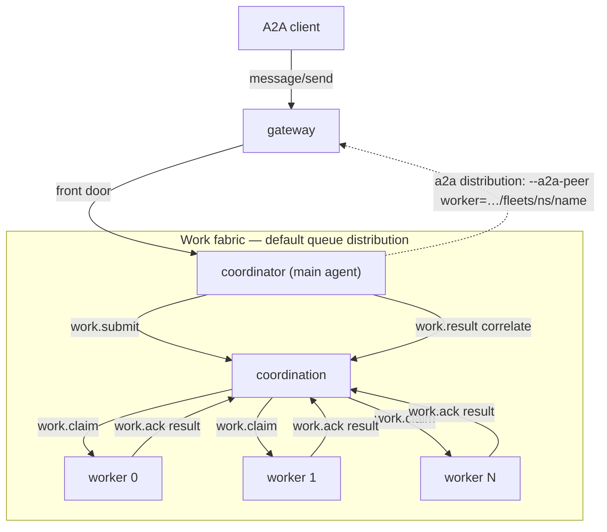

# Architecture

agentctl is a Kubernetes control plane for fleets of conformant AI agents: it
provisions, configures, scales, observes, secures, and exposes agents
declaratively, through Custom Resources. This document is the reference for how
the pieces fit together — the control-plane components, the Custom Resources and
the workloads they render to, the capability planes, the end-to-end request
flows, and the data stores.

## Core principle

agentctl depends on a published **Agent Control Contract (ACC)**, never on a
specific agent binary. Any agent that conforms is managed unchanged. The
reference agent (`agentd`) is one implementation; every interaction with an agent
in this document — the management surface, A2A, the `work.*` claim client, the
downward-API environment, `/metrics` — is an ACC surface, so a conformant agent
wires in identically. The control plane is implemented in Rust.

Two facts shape everything below:

- **The network is the substrate.** Agents are ordinary pods on the pod network.
  They *serve* a management/A2A surface over mTLS-gated HTTPS, and they *dial* the
  control-plane gateways over TLS. There is no on-node bridge, no host socket, no
  vsock.
- **Identity is cryptographic.** Inbound to an agent, the caller presents a
  verified mTLS client certificate that authenticates it as the **Management**
  origin. Outbound from an agent, the gateways attest the caller by its
  **source IP** (its pod IP, resolved to the pod through the Kubernetes API).
  Agents are **secret-free**: the gateways hold and inject every provider and
  tool credential off-pod.

---

## System topology

Eight control-plane Deployments cooperate. External actors (kubectl, A2A peers,
producers, providers, Prometheus) enter through the edges; the data plane is your
agent pods.



Solid arrows are request/data paths; dashed arrows are certificate/out-of-band
paths.

---

## The custom resources

All four CRDs are served under the API group `agentctl.dev`, version
`v1alpha1`. Each carries CEL validation rules, a status subresource, and printer
columns. The manifests live under [`deploy/crds/`](../deploy/crds) and
[`charts/agentctl/crds/`](../charts/agentctl/crds); worked examples are in
[`deploy/examples/`](../deploy/examples).

### Agent

An `Agent` is one logical agent workload. The load-bearing field is `mode`, which
selects the rendered workload kind.

| Field | Meaning |
|---|---|
| `mode` | `once` \| `loop` \| `reactive` \| `schedule` \| `workflow` — the run shape. |
| `image` | The conformant-agent image. Optional — falls back to `operator.defaultAgentImage` when omitted. |
| `instruction` | The agent's inline instruction (required for non-reactive modes). |
| `model.id` | Declared model id (metadata + printer column). |
| `model.pool` | The `ModelPool` this agent binds for inference. |
| `mcpServers` | `MCPServerSet`s (by name) this agent binds for tools. |
| `subscribe` | Reactive-mode MCP resource URIs the agent wakes on. |
| `schedule` | `{ cron, timezone }` for `mode: schedule`. |
| `workflow` | The workflow graph (`inline` or `configMapKeyRef`) for `mode: workflow`. |
| `limits` | `{ maxTokens, maxDepth, maxSteps }` bounding box. |
| `surfaces` | Which control-plane surfaces to expose (`management`/`metrics`/`a2a`). |
| `access` | A2A caller policy: `oidc` (JWT verify + claim authz). |
| `identity.aauth` | **Experimental (RFC 0023).** Opt into an operator-provisioned portable AAuth identity (`aauth:local@domain`) — see [Portable agent identity](#portable-agent-identity-aauth). |
| `capabilities.exec` / `capabilities.egress` / `capabilities.secrets` | Declared privileged capabilities (the lethal-trifecta legs). |
| `substrate` | Substrate tier (see [Substrate](#substrate)). |

`capabilities.exec`, `capabilities.egress`, and `capabilities.secrets` are **declared capabilities** the admission
webhook gates: requesting all three at once (the "lethal trifecta") requires an
explicit opt-in annotation. `capabilities.egress` additionally gains real
enforcement when the agent binds an `auth.mode: aauth` MCP server: admission
requires it, and the operator renders the public-egress NetworkPolicy tier
(see [Portable agent identity](#portable-agent-identity-aauth)).

#### Rendering an Agent

The operator's pure rendering core ([`crates/agentctl-operator/src/render.rs`](../crates/agentctl-operator/src/render.rs))
maps `mode` deterministically to a Kubernetes workload:

| `mode` | Rendered workload | Notes |
|---|---|---|
| `once` | `Job` | `backoffLimit: 0`, `restartPolicy: Never`; run to a terminal status, then exit. |
| `workflow` | `Job` | Supervised one-shot driving the workflow graph (`--mode workflow --workflow <file>`). |
| `schedule` | `CronJob` | Fires the Job on `schedule.cron`; `concurrencyPolicy: Forbid`. |
| `loop` | `Deployment` | Single replica; re-enters on a cadence. |
| `reactive` | `Deployment` | Single replica; idles and wakes on subscribed resources. |

Every rendered pod is identical in its wiring, regardless of kind:

- **Serves** its management/A2A surface mTLS-gated on `:8443`
  (`--serve-mcp https://0.0.0.0:8443`), presenting its own cert-manager-issued
  serving identity (`--serve-cert`/`--serve-key`), and trusting cluster-CA client
  certs (`--serve-client-ca`) — holders of which are the **Management** origin.
- **Dials** the model gateway keyless via `INTELLIGENCE=https://…`, trusting
  the same cluster CA for the hop (`--tls-ca`). No provider token is ever
  rendered into the pod.
- Exposes `/readyz` and `/metrics` on a separate listener (`:9090`,
  `AGENT_METRICS_ADDR`), used as the readiness probe and scraped directly.
- Carries the downward-API identity env (`AGENT_POD_NAME`, `AGENT_POD_UID`,
  `AGENT_POD_NAMESPACE`, `AGENT_NODE_NAME`).
- Is **hardened**: nonroot, no privilege escalation, all capabilities dropped,
  read-only root filesystem (with a writable `/tmp` emptyDir), no auto-mounted
  ServiceAccount token, `RuntimeDefault` seccomp — satisfying the `restricted`
  Pod Security Standard. The only key material in the pod is its own serving
  identity, which the agent hot-reloads on cert-manager rotation without a
  restart.

Bound MCP servers are appended as `--mcp <name>=<mcpgateway>/s/<name>` (plus
`--mcp-tags`); a workflow is mounted as a ConfigMap and passed as `--workflow`.

### AgentFleet

An `AgentFleet` is a replicated, autoscaled set of workers, optionally fronted by
a coordinator ("main agent").

| Field | Meaning |
|---|---|
| `template` | The per-replica worker `AgentSpec`. |
| `scaling` | `{ mode: claim \| shard, minReplicas/maxReplicas (claim), shards N (shard), target }`. |
| `work.source` | The shared work source (an MCP resource URI). |
| `replicas` | Claim-mode replica count; the target of the `scale` subresource (KEDA owns it in steady state). |
| `coordinator` | The optional main agent: `{ template, replicas, distribution }`. |
| `budget` | Per-fleet token cap (`maxTokens`), enforced alongside the pool budget. |
| `work` | `{ source?, maxAttempts (dead-letter), claimTtl (lease TTL) }`. |

#### Rendering an AgentFleet

The worker template's mode is coerced to `reactive` (a fleet member is a
long-lived worker), then the scaling regime selects the workload:



- **Claim mode** renders a `Deployment` with `.spec.replicas` deliberately
  omitted — a KEDA `ScaledObject` is the sole owner of the replica count. The
  ScaledObject's external trigger points at the `scaler`, which reads the
  coordination backlog, giving elastic scale from zero. `minReplicaCount`
  defaults to 0.
- **Shard mode** renders a `StatefulSet` of `scaling.shards` (N) fixed
  partitions with a headless Service for stable per-shard identity. Each pod gets
  `--shard auto/N`; the agent derives its own partition `K` from the ordinal in
  `AGENT_POD_NAME`. Shard mode is never KEDA-driven — the partition count is
  fixed, so no ScaledObject is emitted.
- **Coordinator.** When `spec.coordinator` is set, the operator renders a *second*
  owned `Deployment` named `<fleet>-coordinator` (labeled
  `agentctl.dev/fleet-role: coordinator`, replicas default 1, coerced to
  `reactive`). Its `distribution` controls fan-out: `queue` (default) wires it as
  a producer on the fleet `work.source` (injected as `AGENT_FLEET_WORKSOURCE`);
  `a2a` appends `--a2a-peer worker=<gateway>/fleets/<ns>/<fleet>` so it delegates
  point-to-point through the gateway.

The fleet exposes the `scale` subresource (`.spec.replicas` /
`.status.replicas` / `.status.selector`), so `kubectl scale agentfleet` and an
HPA can read and drive it.

### ModelPool

A `ModelPool` configures the intelligence plane — a pool of model access the
`modelgateway` brokers. Agents hold no provider secret.

| Field | Meaning |
|---|---|
| `provider` | Provider id (free string, e.g. `mock`, `anthropic`, `openai`). |
| `endpoint` | Provider base URL. |
| `credentialSecretRef` | `{ name, key }` of the `Secret` holding the provider API key. |
| `models` / `defaultModel` | Allowed model ids and the default. |
| `budget.maxTokens` | Optional total token budget for the pool. |

`status.usedTokens` reports running consumption against the budget.

### MCPServerSet

An `MCPServerSet` is a reusable bundle of MCP tool servers the `mcpgateway`
brokers. Agents hold no tool-server credential.

| Field (per `servers[]` entry) | Meaning |
|---|---|
| `name` | Server name — the agent's `--mcp` key and the gateway facade path segment (`/s/<name>`). |
| `endpoint` | The remote MCP server URL (Streamable HTTP). The agent never dials this — **except** `auth.mode: aauth`, which is a direct signed dial. |
| `auth` | `{ mode: none \| staticToken \| aauth, tokenSecretRef, header }` — how the server is authenticated (see below). |
| `tags` | Per-tool trifecta capability tags. |
| `budget.maxTokens` | Optional per-server call budget. |

Three `auth.mode`s, chosen by what the remote accepts:

- **`none`** — unauthenticated server, brokered through the gateway facade.
- **`staticToken`** — the `mcpgateway` reads a `Secret`-backed bearer and
  attaches it upstream; the credential is never on the pod.
- **`aauth`** (experimental, RFC 0024) — the **agent authenticates itself**: it
  signs each request (RFC 9421) with its portable AAuth identity, and the
  server verifies against the Agent Provider's JWKS. No credential exists to
  hold, so the operator renders a **direct dial** to `endpoint` (the facade is
  bypassed — a rewriting proxy cannot preserve a signature that covers
  `@authority`/`@path`). Requires the binding `Agent` to carry `identity.aauth`
  and declare `capabilities.egress` (admission-enforced).

### Portable agent identity (AAuth)

> **Experimental (RFC 0023/0024), default-off.** Tracks the unreleased
> `draft-hardt-oauth-aauth` IETF drafts; the reference agent ships the client
> behind a build flag. Enable per-Agent via `spec.identity.aauth` once the
> operator is configured with an Agent Provider (`identity.aauth.provider`).

agentctl's perimeter identity (a source IP resolved to a pod → namespace) is
unforgeable inside the cluster but worthless outside it. AAuth gives each agent
a **portable cryptographic identity** — an Ed25519 key bound to
`aauth:local@domain` by an **Agent Provider (AP)**, presented as short-lived
proof-of-possession tokens — that any resource on the internet can verify from
the AP's published JWKS, without contacting agentctl.

The operator is the **house-provisioner**. For an opted-in `Agent` it:

1. generates a per-Agent Ed25519 key `Secret` (the agent's only identity
   material; the model surface is MCP tools, so the key sits with the harness);
2. pre-registers the key's thumbprint at the AP over the admin API
   (**allowlist enrollment** — the "credential" is a public-key hash sent over
   the operator's authenticated channel; nothing secret reaches the pod);
3. renders the keyless `--aauth-provider` dial; the agent self-enrolls at
   startup and signs every MCP request thereafter;
4. learns the enrolled identity into `status.identity.aauth`, and revokes it at
   the AP on deletion.

**What stays.** The `modelgateway` remains in-path for intelligence — token
budgets require being on the data path, and the AP never is. Only remote
**MCP** servers move to direct signed dials; the mcpgateway continues to broker
credential-bearing servers.

**Egress.** Direct dials need real egress. Admission requires
`capabilities.egress: true` for any `auth.mode: aauth` binding, and the
operator renders a fourth agent-namespace NetworkPolicy
(`agent-aauth-internet-egress`, selecting `agentctl.dev/aauth: "true"` pods):
HTTPS to public address space only, private ranges carved out. Vanilla
NetworkPolicy cannot express per-FQDN egress — a DNS-aware CNI can tighten it
to the declared endpoints.

---

## Control-plane components

Each component is a Deployment with its own container image (eight in total). All
control-plane TLS is issued by cert-manager. Every component exposes Prometheus
`/metrics`.

| Component | Role | Reached by | Talks to |
|---|---|---|---|
| **operator** | Reconciles CRs into workloads; issues per-workload PKI; reconciles NetworkPolicies + KEDA ScaledObjects. | (no inbound API — watches the kube-apiserver) | kube-apiserver, cert-manager, agent workloads |
| **apiserver** | Aggregated API for management verbs. | kube-apiserver aggregator (front-proxy mTLS) | agent pods (mTLS `/mcp`), SubjectAccessReview |
| **admission** | Validating + mutating webhooks. | kube-apiserver (HTTPS webhook) | kube-apiserver (reads `ModelPool` existence) |
| **gateway** | Public A2A HTTP/JSON-RPC + SSE surface. | A2A clients (`:8080` HTTP; optional `:8443` mTLS) | agent pods (mTLS `/mcp`), Postgres, push webhooks |
| **modelgateway** | Intelligence broker (secret-free inference). | agent pods (keyless TLS + plaintext `:8080`) | model providers, Postgres, kube-apiserver (attest) |
| **mcpgateway** | Tools broker (secret-free MCP). | agent pods (keyless TLS + plaintext `:8080`) | remote MCP servers, kube-apiserver (attest) |
| **coordination** | Work-distribution backbone (`work.*` MCP). | agents/producers (`:8080`; optional mTLS) | in-memory or Postgres store |
| **scaler** | KEDA external scaler (scale from zero). | KEDA (gRPC `:9100`) | coordination (`work.stats`) |

### operator

The operator ([`crates/agentctl-operator`](../crates/agentctl-operator)) is a
level-triggered controller. For each `Agent`/`AgentFleet` it: (1) renders the CR
to its workload with the pure render core; (2) server-side-applies that workload
(owner-referenced, so garbage collection reclaims it when the CR is deleted); and
(3) patches status with the conditions taxonomy (`Validated`, `Rendered`,
`Ready`, `Draining`, `Degraded`), `observedGeneration`, and a curated projection
of the agent's live capabilities manifest. A `RenderError` becomes a
`Validated=False` condition rather than a hard failure.

Alongside reconcile it owns three cross-cutting duties:

- **Workload PKI** — for every workload it ensures a cert-manager `Certificate`
  minting the serving identity into the Secret the render mounts, and an
  `agentctl-ca` ConfigMap per agent namespace carrying the cluster CA public
  cert (the agent's client-CA and outbound trust anchor).
- **NetworkPolicies** — on each reconcile it ensures the three per-namespace agent
  policies (default-deny, egress only to DNS and the control-plane gateways,
  ingress only from the control-plane namespace). Gated by
  `NETWORK_POLICIES_ENABLED`; enforced only by a policy-capable CNI.
- **KEDA wiring** — it applies a `ScaledObject` per claim fleet (best-effort; a
  cluster without KEDA simply never gets the object).

It is **leader-elected** over a `coordination.k8s.io` Lease so it is safe to run
at `replicas > 1`. Readiness is *not* gated on leadership — every replica serves
`/healthz`, `/readyz`, and `/metrics` — so a rolling upgrade never deadlocks.

The operator also drives the **guarded shard-resize choreography**: when a shard
fleet's `N` changes, it quiesces the live StatefulSet to 0 pods (draining the
old-N partitions), then flips the applied template to the new N and scales back
up — a stop-the-world rebalance so no key is served by two partitions across the
seam.

### apiserver

The aggregated apiserver ([`crates/agentctl-apiserver`](../crates/agentctl-apiserver))
registers as an `APIService` for `management.agentctl.dev` and serves the
management connect verbs `drain`, `lame-duck`, `cancel`, `pause`, `resume` on
both `agents` and `agentfleets`. It sits behind the kube-aggregator's front-proxy
trust: rustls **requires** a client cert verified against the
`requestheader-client-ca` (so only the kube-apiserver reaches it), it trusts the
proxied `X-Remote-User`/`-Group` identity, and it authorizes each verb with a
`SubjectAccessReview` before acting. It resolves the target to a Running pod IP
and dials the agent directly at its mTLS `/mcp`, presenting the control-plane
client cert (= Management). A fleet verb fans out to **all** Running replicas.

### admission

The admission plane ([`crates/agentctl-admission`](../crates/agentctl-admission))
adds the two concerns the CRDs' CEL rules cannot express:

- **Validating** (`POST /validate`): the image-registry allow-list, cross-object
  `ModelPool` existence, the lethal-trifecta opt-in gate, and OIDC-policy
  well-formedness. These run against both an `Agent` (`spec.*`) and a fleet's
  `spec.template.*` and `coordinator.template.*`, so a fleet cannot smuggle a
  disallowed image or an ungated trifecta.
- **Mutating** (`POST /mutate`): secure defaults — standard labels, a
  conservative `mode`, and a minimal-exposure `surfaces` set. It deliberately
  does not hard-default `substrate`; leaving it unset resolves to `stock-unix`,
  the only rendered tier today (`kata-hybrid`/`sidecar-emptydir` are roadmap
  tiers, rejected at render until implemented).

### gateway (A2A)

The A2A gateway ([`crates/agentctl-gateway`](../crates/agentctl-gateway)) is the
public agent-to-agent surface. It:

- projects a JWS-signed **Agent Card** at
  `/agents/{ns}/{name}/.well-known/agent-card.json` (and `/fleets/…`), fetching
  the agent's capabilities from its pod over mTLS and signing with an Ed25519 key
  published at `/.well-known/jwks.json`;
- bridges JSON-RPC at `POST /agents/{ns}/{name}`, translating the spec method
  (`message/send`, `tasks/get`, …) to the reference method (`a2a.SendMessage`, …)
  and forwarding to the agent's mTLS `/mcp`; `message/stream` pipes the agent's
  SSE byte-stream straight back as `text/event-stream`;
- persists tasks in Postgres (so `tasks/get` survives the agent and `tasks/list`
  returns history) and owns push-notification webhooks (SSRF-guarded — see
  [A2A flow](#a2a-a-call-through-the-gateway));
- serves a mesh registry at `GET /agents`.

Inbound auth has three modes: per-agent **OIDC** (`spec.access.oidc`), a
**trusted-proxy** mTLS identity (a fronting API gateway asserts an
edge-verified identity over an authenticated channel), or a coarse **bearer
token** (`AGENTCTL_API_TOKEN`). A **fleet is one addressable endpoint**: for
`/fleets/{ns}/{name}` the gateway routes to the coordinator (front door) when the
fleet declares one, else load-balances round-robin across worker replicas, with
**task affinity** — a live op on an existing task returns to the pod that owns it.
This includes a **workflow gate-reply**: a `message/send` carrying `message.taskId`
resumes a run paused at the non-terminal `INPUT_REQUIRED` state, and is routed back
to the member that owns that task (rather than round-robined to a fresh worker).

### modelgateway (intelligence)

The model gateway ([`crates/agentctl-modelgateway`](../crates/agentctl-modelgateway))
brokers inference secret-free. An agent dials it keyless
(`POST /v1/infer`, with `/v1/chat/completions` as an alias). The gateway
**attests** the caller by source IP, selects the agent's `ModelPool`, enforces
the budget, **injects** the pool's provider credential (read from the referenced
Secret), forwards to the provider, and **meters** the tokens consumed into
Postgres. It serves a keyless server-auth TLS listener (agents dial the rendered
`https://` URL, trusting the cluster CA) plus a plaintext `:8080` for
health/metrics.

Budget enforcement is **atomic** (no check-then-act race): a request first
*reserves* a conservative upper-bound estimate under a per-pool advisory lock —
admitted only if `committed + outstanding-reserved + estimate <= budget` — then
*reconciles* the reservation to the true token count on success (or releases it on
error). A leaked reservation is excluded from the budget after a TTL and swept.
The pool-wide cap and a per-fleet cap (keyed by `(namespace, pool, fleet)`) are
both enforced this way.

### mcpgateway (tools)

The MCP gateway ([`crates/agentctl-mcpgateway`](../crates/agentctl-mcpgateway))
is the tools-plane analogue of the model gateway. An agent dials
`…/s/<server>` keyless; the gateway **attests** the caller by source IP,
**scopes** it to only the servers of the `MCPServerSet`s its `Agent` binds,
**injects** the server's credential (from a Secret, held off-pod) onto the
upstream hop, and **forwards** the MCP JSON-RPC transparently — the
Streamable-HTTP session and SSE flow straight through, so no MCP state is
terminated at the gateway.

### coordination

The coordination server ([`crates/agentctl-coordination`](../crates/agentctl-coordination))
is the work-distribution backbone and the single serializing point that makes
**exactly-one-owner** hold across replicas. It serves the stable `work.*`
contract over MCP JSON-RPC on `:8080`:

| Method | Purpose |
|---|---|
| `work.submit` | Enqueue an item; returns a `work_id`. |
| `work.claim` | Atomic grant of a pending item to one racer (`{item, ttl_ms}` + claim key). |
| `work.renew` | Extend a live, owned lease. |
| `work.ack` | Terminal settle; records the result and dedupes the claim key. |
| `work.release` | Return an item to pending (re-claimable). |
| `work.stats` | The off-pod backlog snapshot (also `work://pending`) — the scale-from-zero signal. |
| `work.result` | Correlate a submitted `work_id` to its outcome. |
| `work.deadletter` | Inspect/manage the dead-letter queue (`dlq://items`). |

The store sits behind a `ClaimStore` trait: an **in-memory** store is the default
(single replica; monotonic-clock leases) and a durable **Postgres** backend
(`store: postgres`) makes grant-one hold across `>1` replica and survive
restarts via a single conditional UPSERT on `claim_key`. Attested-ownership mode
binds each claim to the caller's source-IP identity so one tenant cannot
ack/release another's lease.

### scaler

The scaler ([`crates/agentctl-scaler`](../crates/agentctl-scaler)) serves KEDA's
`ExternalScaler` gRPC on `:9100`. At replica 0 there is no pod to scrape, so it
reads the coordination backlog (`work.stats` → `pending`) and maps it onto KEDA's
RPCs: `GetMetricSpec`/`GetMetrics` drive the replica count toward
`ceil(pending / threshold)`, and `IsActive` (`pending > activationThreshold`) is
the scale-from-zero gate. A coordination read failure returns the last known
value rather than flapping the fleet to 0.

---

## The planes

Each capability plane is a composition of the components above.

| Plane | Built on | What it gives you |
|---|---|---|
| **Provisioning** | operator + CRDs + admission | Declarative agents/fleets rendered to hardened workloads with per-workload PKI. |
| **Intelligence** | modelgateway + `ModelPool` | Secret-free, metered, budgeted inference. |
| **Tools** | mcpgateway + `MCPServerSet` | Secret-free, scoped MCP tool access; optional direct signed dials (AAuth). |
| **Identity** *(experimental)* | operator + Agent Provider (AAuth) | Portable per-agent cryptographic identity for direct, self-authenticated access to remote resources. |
| **Scaling** | coordination + scaler + KEDA (claim); StatefulSet partitioning (shard) | Elastic scale-from-zero for claim fleets; keyed/ordered partitioning for shard fleets. |
| **A2A** | gateway | Agents and fleets as authenticated A2A endpoints, plus agent-to-agent delegation. |
| **Management** | apiserver | `drain`/`lame-duck`/`cancel`/`pause`/`resume` via kubectl, RBAC-gated. |
| **Observability** | every component + agent | Prometheus `/metrics` scraped directly; OTLP tracing when `OTEL_EXPORTER_OTLP_ENDPOINT` is set. |

---

## End-to-end flows

### Provisioning an Agent

```mermaid
sequenceDiagram
  actor U as kubectl
  participant API as kube-apiserver
  participant ADM as admission
  participant OP as operator
  participant AG as agent pod
  U->>API: apply Agent (image, mode, model.pool, caps)
  API->>ADM: mutate (defaults) then validate (trifecta + registry + ModelPool)
  ADM-->>API: patched + admitted
  OP->>API: watch Agents
  OP->>OP: render workload; ensure PKI (serving cert + per-ns CA)
  OP->>API: server-side-apply Job/Deployment/StatefulSet (restricted PSS, zero pod creds)
  API-->>AG: scheduled + started
  AG->>AG: serve mgmt/A2A on mTLS :8443; expose /readyz + /metrics on :9090
  OP->>API: patch Agent.status (conditions, observedGeneration, contract)
```

### Inference: a call through the modelgateway



### Tools: a call through the mcpgateway



### Scaling: a claim-mode work loop with scale-from-zero

```mermaid
sequenceDiagram
  participant PR as producer
  participant CO as coordination
  participant SC as scaler
  participant KE as KEDA
  participant FL as fleet (0..N)
  PR->>CO: work.submit(item) → work_id
  loop poll
    KE->>SC: IsActive / GetMetrics (gRPC)
    SC->>CO: work.stats → pending
  end
  KE->>FL: scale 0 → N (scale from zero)
  FL->>CO: work.claim(item, ttl) — N racers
  CO-->>FL: granted to exactly ONE; others see the holder
  FL->>FL: process (infer + tools)
  FL->>CO: work.renew at ttl/3; work.ack on success
  Note over CO: claim key deduped; expired lease re-offers on crash; maxAttempts → dead-letter (dlq://items)
  SC->>CO: work.stats → 0
  KE->>FL: scale N → 0
```

Distribution is **pull/claim**, not push: the only assignment is the atomic
claim picking one winner of N racers. Producers submit references; the payload
bytes live in your own store.

### A2A: a call through the gateway



Push webhooks are validated at registration and re-validated on delivery: only
`https://` URLs that resolve to globally-routable addresses are accepted
(loopback, RFC1918/CGNAT, link-local incl. the metadata IP, and IPv6
ULA/link-local are rejected), and the connection is pinned to the validated
address.

### Fleet orchestration: coordinator → workers

A fleet can be a "main agent + workers" system. The coordinator decomposes a
request and fans subtasks to the elastic worker pool — over the work fabric
(default `queue`) or via A2A delegation (`a2a`).



`work.submit` returns a `work_id`; `work.ack` records a result; `work.result`
correlates the outcome; an item is dead-lettered after `work.maxAttempts`
redeliveries. A fleet's `budget` is enforced by the modelgateway alongside the
pool budget. Coordinator replicas (`>1`) are peers, not shards: they coordinate
through the work fabric like any other producer.

---

## Data stores

Durable state lives in Postgres so the gateways stay replicated, stateless front
ends; the coordination server keeps its serializing ledger in memory by default.
Postgres is optional and bundled by the chart (`postgres.mode: bundled` |
`external`); the in-memory paths are the single-replica defaults.

| Store | Owner | Tables | Contents |
|---|---|---|---|
| A2A tasks | gateway | `a2a_tasks`, `a2a_push_configs` | Durable task records + push-webhook configs. |
| Intelligence usage | modelgateway | `intelligence_usage`, `intelligence_reservation` | Committed token ledger + in-flight budget reservations. |
| Coordination work | coordination (`store: postgres`) | `work_items` | Work items keyed by `claim_key` (grant-one across replicas). |

The bundled Postgres hop is plain `NoTls` in-cluster by default (NetworkPolicy-
scoped); in-cluster TLS to the database is opt-in hardening
(`postgres.bundled.tls`). When `store: memory`, run one coordination replica —
its claim ledger is a single in-process `Mutex`, and losing it collapses the
serializing point for dependent fleets.

---

## Security model

The full model is in [security.md](security.md); in brief:

- **Inbound identity to an agent** is a verified mTLS client certificate
  authenticating the caller as the **Management** origin — the only origin
  allowed to drive management/A2A verbs on the agent. Server-name verification is
  skipped on these hops (the agent is addressed by dynamic pod IP); the CA is the
  trust anchor.
- **Outbound identity from an agent** is its attested source IP. A confined pod
  drops `CAP_NET_RAW` and so cannot spoof it. If a request also carries a
  self-asserted `X-Agent-*` identity that disagrees, the attested identity wins.
- **Agents are secret-free**: the gateways hold and inject every provider/tool
  credential off-pod.
- **Pods are hardened** to the `restricted` PSS (nonroot, no privilege
  escalation, all caps dropped, read-only root fs, no auto-mounted SA token).
- **Tenant isolation** is enforced by default-deny NetworkPolicies (egress only
  to DNS + the control-plane gateways; ingress only from the control-plane
  namespace), shipped by the chart and reconciled per-namespace by the operator.
- **Admission** enforces an image-registry allow-list and gates the lethal
  trifecta (exec + egress + secrets) behind an explicit annotation.
- **All control-plane TLS** is issued by cert-manager; **management access** is
  RBAC-gated via SubjectAccessReview.

---

## Substrate

`spec.substrate` selects the isolation tier. The rendering core recognizes three
tier ids — `stock-unix`, `kata-hybrid`, `sidecar-emptydir` — but **`stock-unix`
is the only tier the renderer currently emits**: it renders ordinary hardened
Kubernetes pods. A CR requesting `kata-hybrid` or `sidecar-emptydir` is rejected
with an `UnsupportedSubstrate` render error (surfaced as `Validated=False`) until
those tiers are wired. Leaving `substrate` unset resolves to `stock-unix`.

---

## See also

- [operations.md](operations.md) — install, day-2 runbooks, tuning.
- [security.md](security.md) — the full trust and isolation model.
- [benchmarks.md](benchmarks.md) — throughput, latency, and density numbers.
