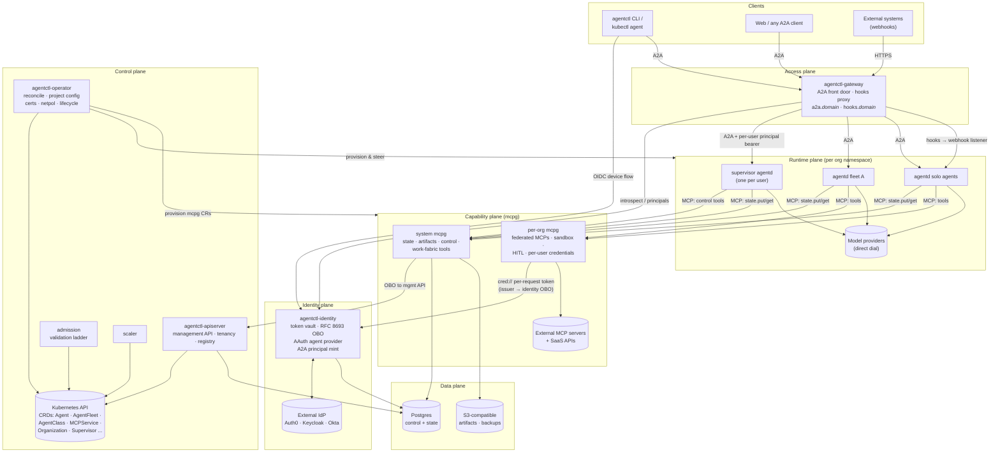
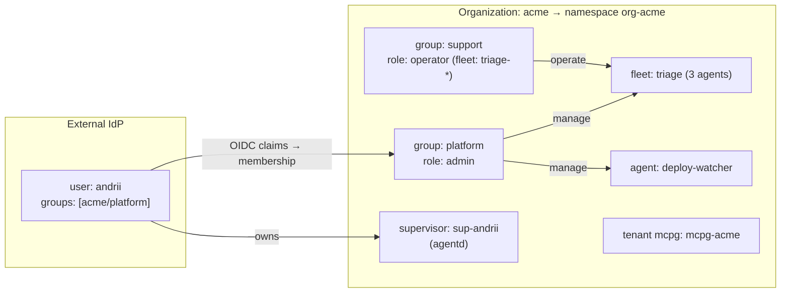
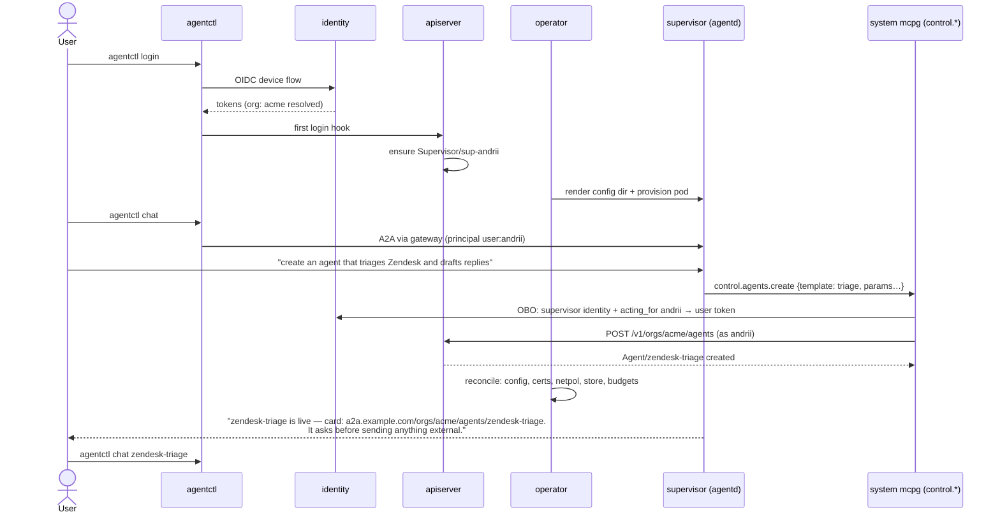
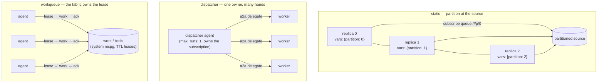

# agentctl v2 — the agent cloud architecture

> **Status:** Proposed (design baseline for the v2 transformation) · **Date:** 2026-08-30
> **Authority:** this document is the architectural umbrella for the v2 track. Decisions
> are recorded in [`docs/v2/adr/`](adr/); subsystem designs in [RFCs 0026–0035](../../rfcs/);
> execution state in [`docs/v2/PLAN.md`](PLAN.md). Where this document and a v1 RFC
> (0001–0025) disagree, **this document and the v2 RFCs win** (see RFC 0026 for the
> supersession map).

agentctl v2 is a **cloud-native orchestration layer for AI agents on Kubernetes**: a
foundational platform that provisions, connects, steers, observes, protects, and
sustains **fleets of durable AI agents** — and that a company can adopt as the backbone
of its own managed agent service, the way Svix is the backbone for webhooks.

The agent runtime is **agentd** (first-class citizen, integrated at the wire only).
The MCP fabric is **mcpg** (every MCP surface we ship is an mcpg gateway). The
protocols are **A2A** for conversation and control, **MCP** for capability, **OIDC/OAuth
(+ RFC 8693 token exchange, AAuth)** for identity. Everything agentctl itself ships is
**Rust**; everything is installed by **Helm**; everything is declarative first.

---

## 1. Vision and principles

**What a user gets.** You install agentctl into a cluster, connect your IdP
(Auth0/Keycloak/Okta/any OIDC), and every user in your organization gets a personal
**supervisor agent** they can talk to over A2A: *"spin up an agent that watches our
Zendesk queue and drafts replies; page me on anything angry."* The supervisor — itself
an agentd instance — calls the **control MCP**, agentctl provisions a durable agent
(config, credentials, network, certificates, storage, budgets), and seconds later the
user is chatting with it, from the CLI, a browser, or any A2A client. The agent runs
for hours, days, or weeks; its tokens stay fresh (identity/OBO), its state survives
restarts and migrations (managed store), its human approvals reach Slack (HITL), and
every tool call it makes is governed, attributed to the human it acts for, and audited.
Agents have **names and @handles**: say *"ask @triage and @deploy-watcher whether the
incident is closed, then summarize"* to your supervisor and it resolves the mentions,
fans the question out over A2A, gathers the replies, and loops until it can answer with
a synthesis (§3.7). The same design serves every posture — **self-hosted enterprise, our
managed cloud, and hybrid multi-cloud**, up to a front supervisor that federates with
supervisors in other clouds (§13.1).

**Principles** (each backed by an ADR):

| # | Principle | ADR |
|---|---|---|
| P1 | **agentd is the runtime; the wire is the contract.** agentctl never links agentd (AGPL boundary); it drives the process contract, config documents, A2A, MCP, metrics. | [ADR-0001](adr/ADR-0001-agentd-wire-only.md) |
| P2 | **A2A is the front door** — for humans↔agents, agents↔agents, and operator control verbs. One protocol, one gateway, principals everywhere. | [ADR-0002](adr/ADR-0002-a2a-primary-protocol.md) |
| P3 | **Every MCP surface is mcpg.** We author tool bindings and small plugins, never bespoke MCP servers. | [ADR-0003](adr/ADR-0003-mcpg-for-all-mcp.md) |
| P4 | **Gateways return as identity data planes.** v1.3.0 removed protocol-translation gateways; v2 introduces gateways that exist to *inject per-user identity* (OBO) and *govern* — something mounting a key can never do. | [ADR-0004](adr/ADR-0004-gateways-as-identity-planes.md) |
| P5 | **Identity is brokered, never owned.** External IdPs hold users; `agentctl-identity` holds *grants* (refresh tokens, agent keys) and exchanges them (RFC 8693 / ID-JAG / AAuth). | [ADR-0005](adr/ADR-0005-identity-brokered-obo.md) |
| P6 | **The control plane is agentic.** Each user gets a supervisor agent; the supervisor's hands are MCP tools whose authority is the *user's own*, via OBO — it can never do more than its human. | [ADR-0006](adr/ADR-0006-supervisor-per-user.md) |
| P7 | **Config is a projected directory, not flags.** Agents receive layered config files + conventional folders (workflows/, skills/, subagents/, context/), exactly as agentd's "a project is a directory" model intends. | [ADR-0007](adr/ADR-0007-config-projection.md) |
| P8 | **Agents never execute code.** No `exec` anywhere in the fleet; computation is a remote, sandboxed, governed MCP service. | [ADR-0008](adr/ADR-0008-no-exec-sandbox-services.md) |
| P9 | **Fleet coordination lives upstream of the agent.** agentd deleted clustering on purpose; partitioning is agentctl's job (config overlays, dispatchers, work-fabric leases). | [ADR-0009](adr/ADR-0009-fleet-coordination-upstream.md) |
| P10 | **Tenancy = organization → group → user**, mapped to namespaces + gateway/apiserver authorization; agents are deliberately single-principal-ish, so multi-tenancy lives above them. | [ADR-0010](adr/ADR-0010-tenancy-model.md) |
| P11 | **Helm is the installer.** One umbrella chart provisions apps, CRDs, PKI, policies, and the mcpg + data subsystems. | [ADR-0011](adr/ADR-0011-helm-install.md) |
| P12 | **Rust only.** All agentctl components: Rust (kube-rs, axum, rustls). No exceptions, no Go. | [ADR-0012](adr/ADR-0012-rust-only-reaffirmed.md) |

---

## 2. The system at a glance



Seven planes, one substrate:

| Plane | Components | Responsibility |
|---|---|---|
| **Declarative** | CRDs + `agentctl-operator` + `admission` | The desired state of every agent, fleet, capability, and tenant — reconciled into pods, config, network, PKI. |
| **Management** | `agentctl-apiserver`, `agentctl` CLI / `kubectl agent`, control MCP | The imperative surface: tenancy, registry, lifecycle verbs, audit — for humans, CI, *and agents*. |
| **Conversation** | `agentctl-gateway` (A2A + hooks) | Every message between users and agents, agents and agents (cross-boundary), and external webhooks. |
| **Identity** | `agentctl-identity` + external IdPs | Who everyone is (users, agents, workloads) and how a days-old agent still acts *on behalf of* its user with fresh tokens. |
| **Capability** | mcpg gateways (system + per-org) + registry | Every tool an agent can touch: governed, credential-injected, quota'd, audited. |
| **Runtime** | agentd instances (supervisors, agents, fleets) | The agents themselves — durable, reactive, workflow-driven. |
| **Data** | Postgres, S3-compatible store | Control-plane records, agent state (via the state tools), artifacts, backups, identity vault. |

---

## 3. Components and responsibilities

### 3.1 agentctl-operator (evolved)

The reconciler. Watches `agentctl.dev/v1alpha2` CRDs and produces:

- **Workloads** — one agentd per `Agent`: `Deployment` (replicas=1) for daemons,
  `StatefulSet` for `store.class: local` (PVC per ordinal), `Job`/`CronJob` for
  one-shots/schedules — with the agentd-documented `podFailurePolicy` compiled from
  the exit-code **intent table** (`complete|terminal|retriable|policy|infra`) that
  agentd's `exit.rs` publishes for exactly this purpose. Probes on `/healthz` /
  `/readyz`; `terminationGracePeriodSeconds` > agentd's 28 s worst-case drain;
  restricted PSS; `runAsNonRoot 65532`; scratch images.
- **Config projection** (§6) — the layered file set: `services.yaml` (org catalog) +
  `agentd.yml` (instance) + `workflows/`, `skills/`, `subagents/`, `context/` folders,
  mounted read-only. `lifecycle.run_until` always explicit (`drained` for daemons,
  `idle` for jobs) — never `auto` (agentd's auto misclassifies webhook-only agents).
- **Network** — default-deny `NetworkPolicy` per namespace; per-agent egress allows
  generated from the *same* catalog that renders `services:` + `security.egress:
  closed` (one source of truth, two enforcement layers).
- **PKI** — cert-manager `Certificate`s: serving + client certs with SPIFFE-style SANs
  (`spiffe://agentctl/<org>/<kind>/<name>`); A2A peer wiring (`a2a.peers` +
  `client_ca`). A2A TLS does not hot-rotate in agentd ⇒ cert renewal triggers a
  rolling restart until the upstream ask lands (§12).
- **Secrets** — projects `{{secret:NAME}}` references as env/file from K8s Secrets
  (External Secrets Operator–friendly); webhook HMACs; A2A principal bearers minted
  by identity.
- **Capability provisioning** — emits mcpg-operator CRs (`MCPGGateway`, `MCPGTenant`,
  `MCPGServer`) for the per-org capability gateways, from `MCPService` registry
  entries.
- **Lifecycle** (§9) — pause/resume/drain via A2A admin verbs; backup/restore/migrate
  orchestration; version rollout with pinned-definition draining; supervised deletes.
- **Steering loop** — watches agent status (A2A `status` command, metrics) into CRD
  `.status`; restarts on `restart_required` config diffs; reconciles fleet partitions.

### 3.2 agentctl-apiserver (evolved)

The management API (`management.agentctl.dev`, axum + rustls; no Go aggregated
apiserver — ADR-0012). Responsibilities:

- **Tenancy**: organizations, groups, users (mapped from IdP claims), quotas; ensures
  a `Supervisor` exists per user on first login (item 7).
- **Registry** (§7): CRUD over scoped catalogs — MCP services, workflows, skills,
  subagent templates, context templates, instruction defaults, settings fragments,
  HITL channel configs — system → org → group → user scoping with override rules.
- **Agent/fleet CRUD + lifecycle verbs**, backed by CRDs (it is a client of the
  Kubernetes API, not a replacement for it — `kubectl` always works too).
- **AuthN/AuthZ**: OIDC access tokens (validated via identity); role model per
  org/group (viewer / operator / admin, resource-scoped); every mutation audited.
- **The control MCP's backend**: the system mcpg's `control.*` tools are HTTP
  bindings against this API, calling with the *agent's* identity exchanged (OBO) for
  the *acting user's* authority — the supervisor can never exceed its human (P6).

### 3.3 agentctl-gateway (evolved)

The unified A2A endpoint (item 8, 22) and webhook front door (item 15). Rust, axum.

- **A2A routing**: `https://a2a.<domain>/orgs/<org>/agents/<name>` (and
  `/orgs/<org>/supervisor` resolving per-caller). Validates the user's OIDC bearer
  (introspection/JWKS via identity), authorizes against tenancy roles, then forwards
  to the target agentd's A2A listener over mTLS **injecting the per-(user, agent)
  principal bearer** minted by identity — so agentd sees a real per-user principal:
  addressed gates (`to: {id: "user:…"}`), per-principal quotas, and `acting_for`
  attribution all work natively (RFC 0029).
- **Agent cards**: serves each agent's card at its public path; the extended card per
  authenticated caller.
- **SSE passthrough**: `SendStreamingMessage`, `SubscribeToTask`, `SubscribeToEvents`
  proxied with resume cursors.
- **Webhook exposure**: `https://hooks.<domain>/<org>/<agent>/<path>` → the agent's
  webhook listener. The gateway adds TLS, tenant rate limits and IP policy; agentd's
  own per-route auth (HMAC/bearer) remains the request authenticator (defense in
  depth). Declared via `Agent.spec.expose.webhooks` (RFC 0029 §5).
- **Cross-cluster federation** (phase M, RFC 0035): gateway↔gateway mTLS for
  multi-cluster routing.

### 3.4 agentctl-identity (new, standalone — item 17)

The identity broker: "AgentCore Identity for your own cluster." Rust; Postgres with
envelope-encrypted secrets (KMS pluggable). Four roles (RFC 0028):

1. **User identity federation** — OIDC against your IdP(s): device flow for the CLI,
   auth-code for web; introspection/JWKS validation for the gateway and mcpg; claim
   mapping to org/group/user.
2. **Token custody + OBO exchange** — stores per-user, per-provider **connections**
   (offline refresh tokens obtained by user consent); exposes an **RFC 8693 token
   exchange** endpoint (and ID-JAG where the IdP supports it): input = workload/agent
   credential + `acting_for` user + target audience; output = short-lived,
   audience-scoped access token, cached and proactively refreshed. This is what lets
   an agent on day 5 of a run still call a user-scoped MCP with a fresh token
   (items 16+17) — the agent itself never holds a refresh token.
3. **Agent/workload identity** — the **AAuth agent provider** for the fleet: enrolls
   each agentd's Ed25519 key via **federated enrollment** (agentd re-reads the
   assertion file per enroll — a projected ServiceAccount token, so enrollment is
   secret-free); issues agent tokens; publishes JWKS that mcpg's AAuth identity
   plugin verifies (RFC 9421) — closing the loop agentd leaves open (it signs
   outbound but never verifies inbound).
4. **A2A principal minting** — per-(user, agent) bearer secrets, projected by the
   operator into each agent's `a2a.principals[]` (hot-reloadable) with
   `labels: {org, group, user}` and quotas; retrieved by the gateway per session.

### 3.5 The capability plane: mcpg (items 6, 10, 11, 12, 18, 26, 32)

mcpg is the governed MCP endpoint — identity chains (incl. AAuth RFC 9421
verification), CEL policy + tool gates, per-caller credential issuers (`cred://`),
quotas, audit fan-out, federation of upstream MCP servers, HITL approvals,
content-addressed blob store. We deploy it in **two tiers** (RFC 0031):

**System gateway** (cluster infra namespace, one per cluster) — the foundational
tools every agent gets:

| Tool family | Backing | Notes |
|---|---|---|
| `state.put/get/list/delete` | Postgres (SQL backend bindings / store plugin) | Implements agentd's **checkpointer profile** exactly (seq CAS; `_meta agent/idempotency_key = "<key>#<seq>"`); per-agent prefix enforced server-side from the verified principal — an agent cannot name another agent's prefix. This is `store.class: managed` (§9). |
| `artifacts.*` | mcpg content store → S3 | Content-addressed blobs, TTL, signed URLs, tenant isolation. |
| `control.*` | HTTP bindings → apiserver | `agents.create/get/list/update/delete`, `fleets.*`, `templates.instantiate`, `agents.pause/resume/drain`, `status/logs/metrics` reads. Authority = caller's agent identity **exchanged for the acting user's** (OBO). Scoped narrow variants for non-supervisor agents that may only spawn subagents in their own space (item 6). |
| `work.*` | evolved `agentctl-coordination` | The work fabric: `lease/ack/nack/push` with TTL leases — fleet partition strategy C (§10). |

**Per-org tenant gateway** (one mcpg per organization — mcpg's supported hard-tenancy
model) — the org's capability world:

- **Federated MCP servers** from the org registry (`MCPService` entries → mcpg
  `federations[]`): prefixes, include/exclude filters, per-tool CEL visibility, SSRF
  guard, pass-through/impersonation upstream auth.
- **Per-user credentials**: `cred://` issuers that call agentctl-identity's exchange
  endpoint — every upstream call carries a fresh token for the human the agent acts
  for (item 17's full chain).
- **`sandbox.*`** — code/command execution as a service (item 11): our
  Apache-licensed mcpg backend plugin runs submissions in disposable K8s Jobs / a
  warm pool (gVisor/Kata optional), caps CPU/mem/wall-clock/output, no network by
  default. The *only* way any agent computes.
- **`hitl.*` + approvals** — mcpg's approval gates + notifier plugins (Slack, email,
  Teams, PagerDuty) plus our HITL bridge that subscribes to agentd gate events and
  routes them to channels; item 32's registrable HITL surfaces.

agentd side: every agent's rendered `services:` catalog points at these gateways with
tool ceilings and trifecta tag floors; `security.egress: closed` + NetworkPolicies
make the catalog the only reachable world.

### 3.6 The runtime plane: agentd (items 3, 16, 25)

agentd runs unmodified, from the signed upstream image, wire-only (P1). **Every
trigger shape agentd supports is a first-class provisioning experience**: a typed
`Agent.spec.triggers[]` covers all ten start kinds — `once`, `manual`, `loop`,
`schedule` (cron/every/at), `webhook`, `subscribe` (MCP-resource listening),
`stream` (event-driven), `signal`, `event`, and `a2aCommand` (typed A2A commands) —
each compiled into a generated start-node workflow around the instruction, with the
trigger set inferring the workload shape (CronJob / Job / Deployment; a sole
schedule defaults to an external CronJob per agentd's own doctrine) and admission
wiring the prerequisites (webhook listener + HMAC, MCPService grants, stream
declarations). Users get "a scheduled agent" or "an agent that watches this
spreadsheet" as a one-liner — via CRD, template, CLI, or by asking their supervisor
— while hand-authored workflows remain fully available underneath (RFC 0033 §2.2).

What agentctl projects onto it, per agent:

- `agentd.yml` + `services.yaml` + conventional folders (workflows, skills, subagent
  templates, context templates) — resolved from the registry scope chain (§7).
- Store: `ephemeral` (emptyDir) | `local` (PVC file store) | `managed`
  (`store.kind: mcp` → system gateway state tools).
- Intelligence: `ModelPool` → `intelligence.endpoints` + `models:` tiers (direct
  dial preserved).
- Identity: AAuth enrollment (projected SA token), `identity.autonomous_as`,
  principal set.
- Budgets (windows + lifetime), limits, priority, approval policy, addressed-gate
  routing.
- Lifecycle: `run_until` explicit; drain timings aligned with pod grace.

Long-running agents (item 16) are the design center: durable store + definition pins
+ budget windows + OBO-fresh credentials + PDBs + priority classes mean 24 h / 7 d /
indefinite runs are ordinary, and a reschedule is a resume, not a loss.

### 3.7 Supervisors (items 4, 7, 14, 20)

A **supervisor is an agentd instance with a governed grant**, one per user (RFC 0027):

- **Provisioned automatically** on first login (apiserver ensures `Supervisor` CR →
  operator renders an `Agent` with `class: supervisor`).
- **Instruction** = layered directive document (agentd RFC 0034 format): system default (registry) → org
  override → user override (`Supervisor.spec.instructionOverride`, prose-only — the
  merge can never widen tool grants; grants come from the class).
- **Hands** = control MCP (`control.*` on the system gateway) + state + artifacts +
  the org's tenant gateway; **authority = the user's own**, because every control
  call is OBO-exchanged to the user's token before it reaches the apiserver (P6).
- **Voice** = A2A via the gateway; the user's default chat target
  (`agentctl chat` with no argument).
- Supervisors are also the **subagent factory**: agents needing cluster-level
  subagents get a narrowed `control.*` grant (create-in-own-space only), so heavy
  children become first-class `Agent`s — visible, budgeted, steerable — instead of
  opaque in-pod processes (item 6). In-pod agentd subagents remain available for
  small, short-lived helpers.
- **@mention orchestration**: every agent has an org-unique `@handle`
  (`Agent.spec.handle`, RFC 0033). When a user's message to their supervisor
  mentions one or more handles, the supervisor's class-provided workflow resolves
  them (`control.agents.resolve` — which also answers *only* agents the user may
  access, because the lookup is OBO'd as the user), fans out `a2a.delegate` calls
  (typed command where the target declares one, prose objective otherwise) with
  per-peer timeouts as expected branches, gathers the replies, and iterates —
  synthesize, ask follow-ups, re-delegate — until it can answer, bounded by its
  budget, a mention cap, and a **hop counter carried in the typed command args**
  (verified upstream: agentd's `max_message_depth` does not propagate across
  instance boundaries, so cross-agent recursion is ours to bound). A peer that
  did not answer is reported as news, never silently dropped. (RFC 0027 §7.1.)

### 3.8 CLI: `agentctl` and `kubectl agent` (items 1, 2)

One Rust binary, two names (krew-distributed plugin manifest already exists). Verb
families:

```
agentctl login | logout | whoami                      # device flow → identity
agentctl chat [agent] | send | inbox                  # A2A via gateway (default: your supervisor)
agentctl apply -f | get | describe | delete           # declarative (CRDs; also plain kubectl)
agentctl create agent [--from-template X] \
  [--schedule cron] [--webhook /path] [--subscribe svc uri] [--stream name] …
                                                      # trigger sugar → Agent CR (RFC 0033 §2.2)
agentctl pause | resume | drain | cancel <agent>      # lifecycle verbs (A2A admin via gateway)
agentctl backup | restore | migrate <agent>           # durability ops
agentctl logs | top | events <agent>                  # observability
agentctl registry {mcp,workflows,skills,templates} …  # scoped registry CRUD
agentctl expose webhook <agent> <path>                # hooks.<domain> route
agentctl org | group | user …                         # tenancy admin
```

`kubectl agent <verbs>` is byte-identical behavior with kubeconfig auth for the
CRD-facing verbs; conversation verbs always go through the gateway with OIDC.

---

## 4. Tenancy and identity model (items 7, 21, 29)



- **Organization** (CRD) → namespace(s) `org-<slug>`, ResourceQuota, IdP claim
  mapping (issuer + group globs → org membership and group roles), the org's tenant
  mcpg, registry scope root.
- **Groups** carry roles (viewer/operator/admin) optionally scoped by label selector
  to fleets/agents — multiple users manage the same fleets (item 21).
- **Users** are IdP subjects; agentctl stores no passwords ever (P5). Each user:
  one supervisor, personal registry scope, personal credential connections.
- **Enforcement points**: gateway (conversation), apiserver (management), mcpg CEL +
  gates (capability), Kubernetes RBAC (declarative), NetworkPolicy (wire).

**Access is claims-driven, not org-chart-driven.** "Org/group/user" is the generic
frame; the mechanism underneath is enterprise IAM: `Organization.spec.accessPolicies`
bind **IdP claims, groups, and scopes** (Okta/Auth0/Keycloak — whatever the company
already centralizes on) to **roles over label selectors**:

```yaml
accessPolicies:
  - match: { groups: ["okta:eng-*"] }          # or claims: {dept: engineering} / scopes
    role: operator
    selector: { matchLabels: { team: engineering } }   # only engineering-labeled agents
  - match: { groups: ["okta:platform-admins"] }
    role: admin
    selector: {}                                        # all agents in the org
```

Agents/fleets carry ordinary labels (`team: engineering`); the resolved policy is one
document that **every** enforcement point consumes — gateway routing, apiserver verbs,
mcpg tool visibility, the K8s RBAC mirror — so "engineering sees engineering's agents,
marketing doesn't, admins see everything" is one rule stated once. Policy changes take
effect on the next token validation; no per-agent reconfiguration. (RFC 0033 §
Organization; RFC 0028 §3.)

### The on-behalf-of chain (item 17)

```mermaid
sequenceDiagram
    actor User as andrii (browser/CLI)
    participant GW as agentctl-gateway
    participant AG as agentd (agent)
    participant TG as tenant mcpg
    participant ID as agentctl-identity
    participant EXT as upstream MCP / SaaS API

    User->>GW: A2A SendMessage (OIDC access token)
    GW->>ID: validate token, resolve principal
    GW->>AG: forward over mTLS + principal bearer (user:andrii)
    Note over AG: run starts; acting_for = user:andrii<br/>rides every tool call in _meta
    AG->>TG: tools/call zendesk.reply (AAuth-signed, _meta acting_for)
    TG->>TG: verify agent identity (RFC 9421, JWKS from identity)
    TG->>ID: cred://identity/zendesk#andrii → RFC 8693 exchange<br/>(agent token + acting_for → audience-scoped user token)
    ID-->>TG: fresh access token (cached, auto-refreshed)
    TG->>EXT: upstream call with injected token<br/>(inbound auth headers stripped)
    EXT-->>TG: result
    TG-->>AG: tool result (audited, quota-counted)
    Note over AG,ID: day 5 of the run: same flow, same freshness —<br/>the agent never held a refresh token
```

Where a user hasn't yet consented to a provider, the exchange returns a *connection
required* error; the HITL bridge turns it into an approval card with the consent URL
— the human connects once, the agent proceeds (RFC 0028 §6).

---

## 5. The supervisor experience (user journey)



Everything the supervisor did, the user could have done directly (`agentctl apply
-f`, GitOps, raw `kubectl`); the supervisor is a *convenience with the same
authority*, not a privileged path.

---

## 6. Agent anatomy: from CR to running agentd

```mermaid
flowchart LR
    subgraph sources["Registry scope chain (item 12/25/26)"]
        SYSD["system defaults"]
        ORGD["org: AgentClass"]
        GRPD["group overrides"]
        SPEC["Agent spec"]
    end
    subgraph render["operator: render"]
        SVC["services.yaml<br/>(catalog: mcpg endpoints,<br/>tags floors, ceilings, rates)"]
        CFG["agentd.yml<br/>(intelligence, store, a2a,<br/>lifecycle, limits, budgets,<br/>identity, security)"]
        WF["workflows/ dir"]
        SK["skills/ dir"]
        SA["subagents/ dir"]
        CTX["context/ dir"]
    end
    subgraph pod["Pod"]
        AGD["agentd -c /etc/agentctl/services.yaml<br/>-c /etc/agentctl/agentd.yml"]
        VOLS["mounted read-only volumes<br/>+ secrets (env/file refs)<br/>+ projected SA token (AAuth enroll)"]
    end
    ADM2["admission: schema check +<br/>agentd --validate-config +<br/>policy ladder (trifecta, egress, budgets)"]
    sources --> render --> ADM2 --> pod
```



Rules the projection enforces (from the agentd v1.3.1 analysis):

- Layer order is fixed: catalog first, instance second; lists replace on merge, so
  overlays redirect via `vars:` + `{{config.*}}`, never by restating.
- Secrets only ever as `{{secret:NAME}}` / `{{secret-file:}}` references.
- `run_until` explicit; drain < pod grace; probes per agentd's manifests;
  `AGENT_POD_NAME` downward API feeds `agent.name` (store identity fence).
- Validation is **the binary's own**: admission shells `agentd --validate-config`
  in a sandboxed job (the published JSON schema lags the structs; the binary is the
  authority) and diff-reports effective surfaces.
- Reloadable diffs → SIGHUP path once verified upstream; until then any config change
  is a **rolling restart** — safe by construction (durable store, drain, definition
  pins).

---

## 7. Registry and provisioning (items 12, 25, 26, 32)

One registry, four scopes, first-match-wins with **narrowing-only overrides**
(a lower scope may remove/narrow, never widen tags, ceilings, or budgets):

```
system (chart values + CRs in infra ns)
  └─ organization (AgentClass per org)
       └─ group
            └─ user (personal connections, supervisor instruction override)
```

Registrable element kinds → where they land:

| Kind | Stored as | Rendered into |
|---|---|---|
| MCP service | `MCPService` CR | `services.yaml` entry + tenant-mcpg federation + NetworkPolicy egress |
| Workflow | ConfigMap/OCI ref (`WorkflowSet`) | `workflows/` folder |
| Skill | ConfigMap/OCI ref (`SkillSet`) | `skills/` folder |
| Subagent template | in `AgentClass` / `AgentTemplate` | `subagents/` folder |
| Context template | ConfigMap ref | `context/` folder |
| Model access | `ModelPool` | `intelligence` + tiers |
| Settings fragment | `AgentClass.spec.settings` | `agentd.yml` sections |
| Supervisor instruction | `AgentClass.spec.supervisorInstruction` | supervisor's instruction document |
| HITL channel | `AgentClass.spec.hitl` | mcpg approval notifiers + HITL bridge routes |
| Agent template | `AgentTemplate` CR | instantiable via CLI/control MCP |

`agentctl registry …` and the control MCP expose the same CRUD; GitOps applies the
CRs directly. (RFC 0032.)

---

## 8. Communication fabric (items 5, 8, 15, 22)

- **North–south (user ↔ agent)**: always the gateway (§3.3). Per-user principals
  end-to-end; quotas and audit at both gateway and agentd.
- **East–west (agent ↔ agent, same org)**: direct A2A over operator-issued mTLS —
  the operator renders `a2a.peers` + principal entries from `Agent.spec.peers`
  (or fleet wiring), plus the matching NetworkPolicies. Typed A2A commands
  (`command:` + `schema:` on `a2a` starts) are the recommended inter-agent contract.
- **Cross-org / cross-cluster**: via gateway federation only (no direct trust).
- **Webhooks in**: `hooks.<domain>` → agent webhook listener; HMAC secrets
  provisioned; per-route rates at both layers (item 15).
- **Signals/waits**: A2A `workflow.signal` command through the gateway; one-shot
  callback URLs (agentd `wait {on: webhook}`) exposable the same way.
- **In-pod**: agentd's own subagents / instance children over its unix-socket A2A —
  untouched by agentctl (below our line of sight, bounded by the pod).

---

## 9. Durability and lifecycle (items 16, 24)

**Store classes** (`Agent.spec.store.class`):

| Class | Backing | Survives | Migration |
|---|---|---|---|
| `ephemeral` | emptyDir file store | restart | none (recomputable work) |
| `local` | PVC file store (StatefulSet) | reschedule (same zone) | PVC move |
| `managed` *(default for daemons)* | state tools on system mcpg → Postgres | anything | free — state is already external |

**Verbs** (CLI/control MCP → operator/gateway):

- `pause` / `resume` — A2A admin verbs (durable, reversible; intake queues).
- `drain` / `stop` — graceful drain then scale-to-0, store retained.
- `backup` — state snapshot (per-agent prefix export) + artifacts manifest → S3;
  scheduled or on-demand.
- `restore` — new agent (same name/generation bump) from a snapshot.
- `migrate` — drain → reschedule (managed) / PVC move (local) / cross-cluster
  backup+restore (phase M).
- `upgrade` — agentd image/version per agent; canary via fleet partitions;
  in-flight runs finish under pinned definitions; `--fresh` exposed as an explicit
  reset verb.
- `delete` — drain, final backup (policy), remove; store retention window.

Long-run posture: PDB per agent, priority classes, budget windows with `on_exhausted`
policies, identity keeps credentials fresh indefinitely, `run_until: drained` daemons.

## 10. Fleets, sharding, scaling (items 9, 16)

agentd owns *vertical* concurrency (runs/turns/fan-out per instance). Everything
horizontal is agentctl (P9). `AgentFleet.spec.partitioning.strategy`:



- **static**: operator renders per-replica overlays (`vars: {partition}`) — also how
  "replica 0 arms the nightly schedule" is expressed. Resize = guarded re-partition
  (drain affected partitions first; the v1 stop-the-world lesson carries over).
- **dispatcher**: fleet = 1 dispatcher + worker pool CRs + peer wiring.
- **workqueue**: `agentctl-coordination` evolves into the `work.*` MCP tools —
  at-least-once, idempotency by item id (agentd's derived keys compose with this).
- **Autoscaling**: `agentctl-scaler` on `agent_inbox_pending` (the *live* metric),
  `agent_pressure_level`, `agent_turns_queued`; scale-from-zero for webhook/a2a
  agents by parking their routes at the gateway. Breaker state is per-replica —
  scaling out multiplies probes against a down dependency; the scaler damps on
  breaker-open signals.

**Multi-cluster** (item 9; RFC 0035, phased): hub/spoke. Hub runs apiserver,
identity, gateway, registry; spokes run operator + runtime + capability planes; a
`Cluster` CR registers spokes; fleets get placement policies; migration rides
backup/restore; identity and image trust span clusters. Deliberately **deferred**
behind single-cluster GA (see PLAN).

## 11. Security fabric (items 13, 23, 28)

- **PKI**: cert-manager, mesh CA, SPIFFE-style SANs; serving + client certs for every
  component; per-agent A2A certs.
- **Network**: default-deny; agent egress = {tenant mcpg, system mcpg, model
  providers, declared peers}; generated with the services catalog (one source of
  truth). Gateway/hooks are the only ingress.
- **Secrets**: K8s Secrets (+ESO); identity's vault for user grants (envelope
  encryption, KMS pluggable); agentd sees references only; mcpg strips inbound auth
  headers at egress (anti-exfiltration); tokens never in argv/labels/logs.
- **Workloads**: restricted PSS, scratch images, non-root, read-only rootfs, no exec
  anywhere (P8); optional gVisor/Kata for sandbox pool (RuntimeClass).
- **Policy ladder**: admission (schema → binary validation → trifecta/egress/budget
  floors) → agentd `security.policies` (runtime tool verdicts) → mcpg gates/CEL →
  apiserver RBAC. Tag floors flow from the registry and cannot be under-declared
  downstream.
- **Supply chain**: cosign-verified images (agentd, mcpg, ours), SBOM attestations,
  signed charts; agentd images pinned by digest per `AgentClass`.
- **Audit**: gateway + apiserver + identity audit logs; mcpg signed audit chain;
  agentd `audit.sink: [stream]` shipped by a system workflow to the state store —
  one queryable trail from "user said" to "token exchanged" to "tool ran."

## 12. Observability (item 28)

- **Metrics**: Prometheus scrape of every agentd (`agent_*`, schema 1.2), mcpg
  (`mcpg_*`), and our components; ships dashboards (fleet health, pressure, budgets,
  gate latency, token spend by org/user).
- **Traces**: W3C context end-to-end (gateway mints/propagates; agentd and mcpg both
  forward `traceparent`); OTLP collector wiring in the chart.
- **Events/status**: agent status (A2A `status`) reconciled into CRD `.status`
  (`kubectl agent get agents` shows real state: runs, gates open, budget remaining,
  pressure); `SubscribeToEvents` powering `agentctl chat`/`inbox` live views.
- **Known metric traps** encoded in the scaler/dashboards: `agent_inbox_pending` is
  live, `agent_pending_events` is reserved-flat; several agentd counters are
  child-process-local.

### Billing-ready metering

Observability is designed so a **billing system can be built on top without
re-instrumenting**: a closed, versioned vocabulary of **metering events**, every one
attributed `{org, group, user (acting_for), agent, fleet}`:

| Meter | Source |
|---|---|
| agent-hours by class/store-class; agent & fleet counts | operator status loop |
| tokens by pool/tier; model calls | agentd usage surfaces + governor events |
| tool calls by `MCPService`; OBO exchanges by audience | mcpg audit + identity |
| sandbox CPU-seconds / invocations | sandbox service |
| state ops + stored bytes; artifact bytes | state/artifacts services |
| webhook deliveries; A2A messages by route | gateway |
| gates raised/answered; HITL notifications | HITL fabric |
| active seats (users with supervisors); feature/integration enablement | apiserver |

Events land durably (audit-grade stream) *and* as Prometheus counters; the apiserver
exposes an aggregation/export API (CSV + JSON) keyed by billing period. Gates and
quotas already exist at every layer (org quotas, per-principal budgets, mcpg rate/
budget policies), so entitlement enforcement — "this plan gets N agents, M tokens,
these integrations" — is a policy layer over signals the platform already emits.

### Upstream asks (tracked in PLAN, filed against agentd/mcpg)

1. agentd: A2A admin `reload` verb (or verified `--watch-config` on ConfigMap swap).
2. agentd: A2A TLS hot-rotation (webhook listener already rotates).
3. agentd: restore `contract_version`/`surfaces` (or equivalent) in `--capabilities`;
   include webhooks + stream/webhook start kinds.
4. agentd: fix `run_until: auto` webhook/stream misclassification; align the three
   long-lived lists.
5. agentd: published JSON schema catch-up ($defs Service.kind/methods/breaker,
   A2aPeer.service); Dockerfile license label (Apache-2.0 → AGPL).
6. mcpg: store-role MCP tool façade (state profile) upstreamable from our bindings;
   sandbox backend (their RFC 0022) — we implement, offer upstream.
7. AAuth upstream (from our RFCs 0023–0025): delegation-chain story; agentd inbound
   verification (mcpg covers the MCP leg; A2A leg stays mTLS meanwhile).

## 13. Installation and provisioning (items 19, 31)

One umbrella Helm chart (`charts/agentctl`), extending the existing one:

```
helm install agentctl agentctl/agentctl \
  --set global.domain=agents.example.com \
  --set identity.providers[0].issuer=https://login.example.com \
  --set identity.providers[0].clientId=agentctl \
  --set storage.postgres.mode=bundled \        # or external
  --set storage.objectStore.endpoint=…         # S3-compatible
```

The chart provisions: CRDs; operator/apiserver/gateway/identity/admission/scaler;
mcpg-operator (dependency) + system gateway; Postgres (bundled or external); PKI
(cert-manager Issuers); default NetworkPolicies; dashboards; the system registry
defaults (foundational MCP catalog, default supervisor instruction, base AgentClass);
optionally the agentd-ui hosted image for browser chat. Day-2: `Organization` CRs (or
`agentctl org create`) bring tenants; GitOps everything. Air-gap: OCI mirrors +
mcpg's plugin mirror CRD. Sizing profiles in values (`dev`, `production-ha`).

### 13.1 Deployment postures — one design, four shapes

The same chart, CRDs, and APIs serve every posture; nothing is forked per shape:

| Posture | Shape |
|---|---|
| **Self-hosted enterprise** | One cluster (or hub+spokes), the company's IdP, one or many `Organization`s (business units). Air-gap supported. |
| **Managed cloud (ours)** | agentctl as the backbone of the hosted service: an `Organization` per customer, hub per region, the management API + gateway as the product surface, metering export feeding billing (§12). |
| **Sold for self-hosting** | Same artifacts a customer runs themselves; license/entitlement hooks ride the same metering vocabulary; no phone-home required. |
| **Hybrid / multi-cloud** | Hub + spokes across clouds (RFC 0035): residency-pinned orgs, per-cloud capability planes, cross-cloud migration via backup→restore. **Supervisor federation** — a user's front supervisor holds remote supervisors (other clouds, other agentctl installations) as A2A peers and fans estate questions across them exactly like @mentions — is the PM-track extension of the same mention-orchestration machinery. |

The invariant across all four: **everything is reachable through the two product
surfaces** (management API, A2A gateway) with IdP-federated identity — which is what
makes the managed and self-hosted stories the same software.

## 14. What you can build on it (item 27)

Everything a managed offering needs is API-first: tenancy + registry + agent CRUD
(apiserver), conversation (gateway, per-user principals), billing signals (token
budgets per org/user, mcpg usage metering), audit trails, white-label UI hooks (the
thin agentd-ui + gateway origins). A company adopts agentctl the way one adopts Svix:
its product calls the management API to create per-customer orgs, templates, fleets —
agentctl is the backbone; the product is theirs. The multi-tenant hosting profile and
rate-limit/billing export are tracked as phase items (PLAN P7).

## 15. Requirements traceability (items 1–32)

| # | Requirement | Where |
|---|---|---|
| 1 | `agentctl` CLI ≙ kubectl for agents | §3.8, RFC 0016 (evolved) |
| 2 | `kubectl agent` plugin | §3.8 (same binary; krew manifest exists) |
| 3 | agentd first-class runtime | §3.6, ADR-0001, RFC 0026 |
| 4 | Supervisor agent in the operator's orbit, A2A-drivable | §3.7, §5, RFC 0027 |
| 5 | A2A as main protocol; agentctl wires agent↔agent comms | §8, ADR-0002, RFC 0029 |
| 6 | mcpg-based control MCP for spawning agents/subagents centrally | §3.5, §3.7, RFC 0027/0031 |
| 7 | Per-user supervisor | §3.7, §4, RFC 0027 |
| 8 | Unified A2A endpoint with principal routing | §3.3, RFC 0029 |
| 9 | Multi-cluster, sharding, scaling | §10, RFC 0034/0035 |
| 10 | Foundational MCPs for durability (state etc.) | §3.5, §9, RFC 0031 |
| 11 | No code/command execution in agents; MCP-exposed services instead | §3.5 sandbox, ADR-0008 |
| 12 | Centrally defined MCP servers with per-user override; provisioned settings | §7, RFC 0032 |
| 13 | Operator orchestrates networking/certs/security/secrets | §3.1, §11 |
| 14 | Supervisors crafted for dynamic agent management in user space | §3.7, RFC 0027 |
| 15 | Pipe/expose agentd HTTP endpoints (webhooks, signals) | §3.3, §8, RFC 0029 §5 |
| 16 | Indefinite-duration agents (24 h/48 h/7 d+) | §3.6, §9, §4 (OBO) |
| 17 | Standalone Identity with OBO token exchange feeding a gateway | §3.4, §4, ADR-0004/0005, RFC 0028/0030 |
| 18 | mcpg whenever an MCP server is needed | ADR-0003, RFC 0031 |
| 19 | Helm installation | §13, ADR-0011 |
| 20 | Supervisor instructions: default + user override | §3.7, §7, RFC 0027 |
| 21 | Orgs/groups; shared fleet management | §4, ADR-0010 |
| 22 | User can reach any agent through the gateway | §3.3, §8 |
| 23 | Secrets store integration | §11, RFC 0028 (vault) |
| 24 | Full lifecycle: restore/migrate/backup/pause/stop/remove | §9, RFC 0033 |
| 25 | Pre-provisioned config/workflows/skills per agentd docs | §6, §7, ADR-0007 |
| 26 | Per-tenant registries of MCP/workflows/settings | §7, RFC 0032 |
| 27 | Backbone for managed agent services (Svix-style) | §14 |
| 28 | Secure, observable, durable, scalable, reliable, agentic SDLC | §11, §12, PLAN (eval/rollout items) |
| 29 | Auth0/Keycloak/Okta + modern OAuth/OIDC AI extensions | §3.4, RFC 0028 |
| 30 | Modern protocols and approaches | throughout (A2A, MCP, RFC 8693/9421/9728, Gateway-API-ready) |
| 31 | Infra orchestration, not just binaries | §3.1, §11, §13 |
| 32 | Registration of HITL MCPs, settings, other elements | §7, §3.5 (HITL), RFC 0032 |
| 33 | Agent naming + @handles; supervisor @mention fan-out/gather loop | §1, §3.7, RFC 0027 §7.1, RFC 0033 (`spec.handle`) |
| 34 | Enterprise / self-host / managed / multi-cloud postures; supervisor-of-supervisors | §13.1, RFC 0035 |
| 35 | Scoped MCP registry (per user/org/group) of mcpg + external services, OBO-federated for credential UX | §7, RFC 0032, RFC 0030 |
| 36 | Centralized enterprise IAM: Okta-style claims/scopes → team-scoped agent access, admins over all | §4 (accessPolicies), RFC 0028 §3, RFC 0033 (Organization) |
| 37 | Billing-ready capabilities: metering events, gates, signals, observability for a billing layer | §12 (metering), §13.1, PLAN P7 |
| 38 | Spin up every agent shape agentd supports — scheduled, webhook/event-driven, MCP-listening, stream-consuming, command-serving — as a one-liner | §3.6, RFC 0033 §2.2, RFC 0027 §5 |

## 16. Document map

- **ADRs**: [`docs/v2/adr/`](adr/) — ADR-0001 … ADR-0012 (decisions above).
- **RFCs** (subsystems): 0026 umbrella/supersession · 0027 supervisors & control MCP ·
  0028 identity · 0029 A2A gateway v2 & exposure · 0030 capability egress & OBO ·
  0031 foundational MCP services · 0032 registry & provisioning · 0033 CRD API v2 &
  lifecycle · 0034 fleets & scaling v2 · 0035 multi-cluster (draft).
- **Plan**: [`docs/v2/PLAN.md`](PLAN.md) — phases P0–P8, progress-tracked work items,
  deferred register.
