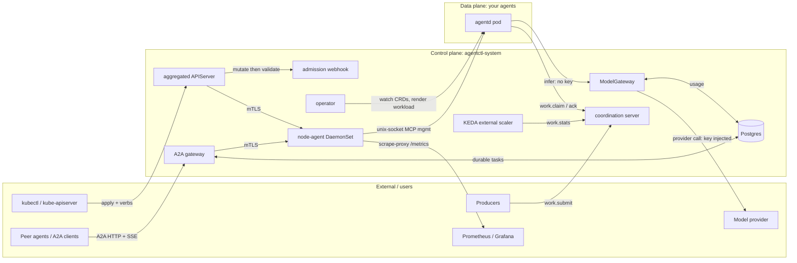
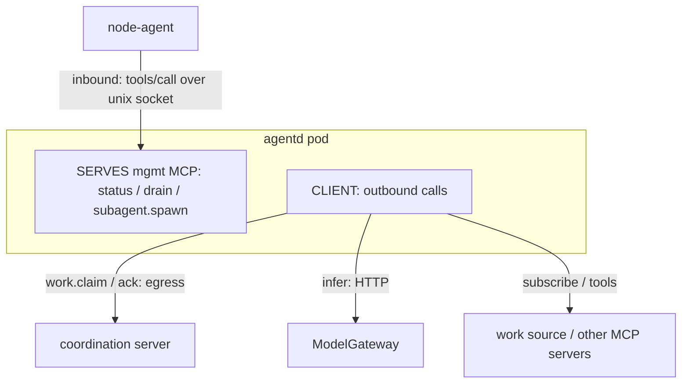

agentctl is several small Rust components, each owning one **plane** of the agent
lifecycle. Every arrow into an agent is an
[Agent Control Contract](/docs/contract) surface, so any conformant
agent (the reference is [agentd](/docs/getting-started)) wires in identically.

This page is the curated map. For every slice in detail — with the full set of
sequence and topology diagrams — see the
[architecture & wiring reference](/docs/architecture).

## Component topology

## The planes

| Plane | Components | What it does | Guide |
|---|---|---|---|
| **Provisioning** | operator, admission webhook | reconcile `Agent`/`AgentFleet` CRDs into `Job`/`Deployment`/`CronJob`/`StatefulSet`; gate the lethal trifecta + image registries | [Provisioning](/docs/guides/provisioning) |
| **Management** | aggregated APIServer, node-agent | SAR-gated `drain`/`lame-duck`/`cancel` verbs proxied over mTLS, then a kernel-attested unix socket to the agent | [Architecture §5](/docs/architecture) |
| **Intelligence** | ModelGateway | secretless, metered, budgeted model access — the agent holds no provider key | [Intelligence](/docs/guides/intelligence) |
| **A2A** | A2A gateway, Postgres | JWS-signed Agent Cards; durable `message/send` + `message/stream` tasks; OIDC / trusted-proxy auth | [A2A](/docs/guides/a2a) |
| **Scaling** | coordination server, KEDA external scaler, KEDA | `work.*` claim ledger; backlog drives KEDA scale 0..N..0 | [Scaling](/docs/guides/scaling) · [Work](/docs/guides/work) |
| **Observability** | every component `/metrics`, node-agent scrape-proxy | `agentctl_*` control-plane metrics + agent `agent_*` metrics | [Observability](/docs/guides/observability) |

## An agent's two MCP directions

An agent **serves** a management profile (the control plane drives it) and is a
**client** for work, intelligence, and sources (it reaches out). These are
opposite directions and easy to conflate:

## Cross-cutting properties

- **Two trust planes meet at the agent.** *Inbound* management is mTLS
  (APIServer -> node-agent) then a kernel-attested (`SO_PEERCRED`) unix socket
  (node-agent -> agent). *Outbound* work and intelligence is the agent dialing
  out. See [the security model](/docs/guides/security/overview).
- **State.** Postgres is shared durable state for the A2A gateway (tasks) and the
  ModelGateway (token usage); the coordination server's claim ledger is in-memory
  behind a `ClaimStore` trait for a future durable backend.
- **The contract is the boundary.** agentctl never depends on a specific agent —
  see [P0](/docs/contract).
