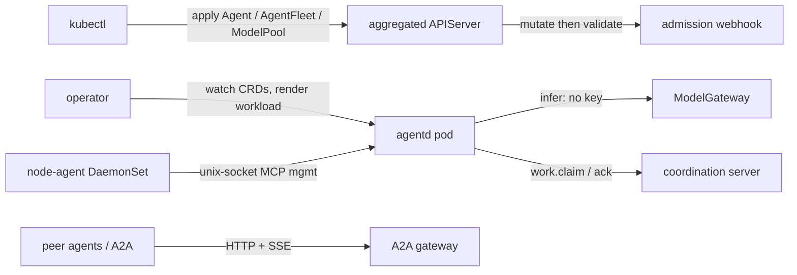

agentctl is a **Kubernetes control plane** for fleets of contract-conformant AI
agents. You declare intent as a Kubernetes custom resource — an [`Agent`](/docs/concepts/crds)
or [`AgentFleet`](/docs/concepts/crds) in the group `agents.x-k8s.io/v1alpha1` —
and the control plane reconciles it into the right workload (a `Job`,
`Deployment`, `CronJob`, or `StatefulSet`), wires the capabilities you asked for,
and reports a curated status back onto the resource.

Every capability — intelligence routing, agent-to-agent (A2A) calls, work
coordination, autoscaling, OIDC, mTLS, attested identity, NetworkPolicies — is
**gated default-off**. A stock install runs the seven control-plane components
and nothing else until you opt in.

## The contract, not a vendor

agentctl never depends on a specific agent. It consumes the
**[Agent Control Contract (ACC)](/docs/contract)** — a set of published
JSON Schemas, frozen data tables, and golden fixtures — and drives *any* binary
that conforms. This is the project's foundational principle (**P0**).

The reference agent used as the worked example throughout these docs is
**agentd**: a ~1.3 MB static binary (`ghcr.io/agentd-dev/agentd:1.0.0`) that
satisfies the ACC. It is the *reference* implementation, never privileged.

## The worked example

Every guide threads the same `agentd` example so the concepts stay concrete:

1. **[Install on kind](/docs/getting-started/install)** — a one-node cluster with
   cert-manager and the Helm chart.
2. **[Your first agent](/docs/getting-started/first-agent)** — a single `agentd`
   `Agent`, reconciled to a workload, status patched.
3. **[Your first fleet](/docs/getting-started/first-fleet)** — a claim-mode
   `AgentFleet` that KEDA scales from zero.

From there, the [guides](/docs/guides/provisioning) layer on intelligence,
budgets, A2A, work distribution, the security model, and day-2 operations.

## Architecture at a glance

See [the planes](/docs/concepts/planes) for the full topology and the
[architecture & wiring](/docs/architecture) reference for every slice.
