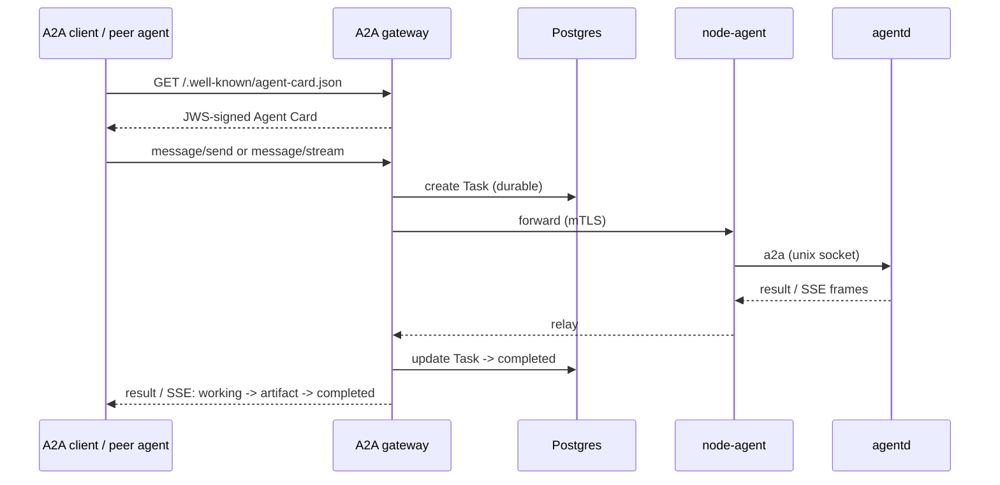

The **A2A (agent-to-agent) gateway** makes your agents reachable by peer agents
and external clients. It serves a JWS-signed Agent Card, accepts `message/send`
and streaming `message/stream` requests, persists each as a durable task in
Postgres, and forwards to the agent over mTLS + the kernel-attested unix socket.
The source of truth is [RFC 0013](/docs/rfc-0013).

## The request path

## Agent Cards

The gateway projects an Agent Card from the agent's (or fleet's) live capabilities
and **JWS-signs** it; callers verify the signature against the gateway JWKS. A
fleet card is projected from a fleet member that serves the management profile.

## Methods

The A2A surface carries both spellings on every method (the normative spelling is
a deferred contract decision — a gateway translates until then; see
[the ACC spec](/docs/contract-spec)):

| Spec method | Reference method |
|---|---|
| `message/send` | `a2a.Send` |
| `message/stream` (SSE) | `a2a.Stream` |
| `tasks/get` | `a2a.TasksGet` |
| `tasks/list` | `a2a.TasksList` |
| `tasks/cancel` | `a2a.TasksCancel` |
| `tasks/resubscribe` | `a2a.TasksResubscribe` |

The full registry is `contract/schemas/a2a.methods.json`.

## Authenticating callers

The A2A ingress is open by default (network-isolated). Layer auth as needed:

- **[API token](/docs/guides/security/api-token)** — a coarse in-cluster bearer gate
  (`AGENTCTL_API_TOKEN`).
- **[Per-agent OIDC](/docs/guides/security/oidc)** — `spec.access.oidc` gates the
  surface on a JWKS-verified JWT plus `requiredClaims`, and can forward the
  caller's identity to the agent.
- **[Trusted front-proxy](/docs/guides/security/trusted-proxy)** — an external API
  gateway (e.g. APISIX) terminates edge auth and asserts identity over mTLS; the
  gateway strips spoofed headers from untrusted callers.

See [architecture §7a/§7b](/docs/architecture) for the OIDC and trusted-proxy
sequence diagrams.

## Next

- [Security: OIDC](/docs/guides/security/oidc) ·
  [Trusted proxy](/docs/guides/security/trusted-proxy)
- [Work distribution](/docs/guides/work) — the other outbound surface.
