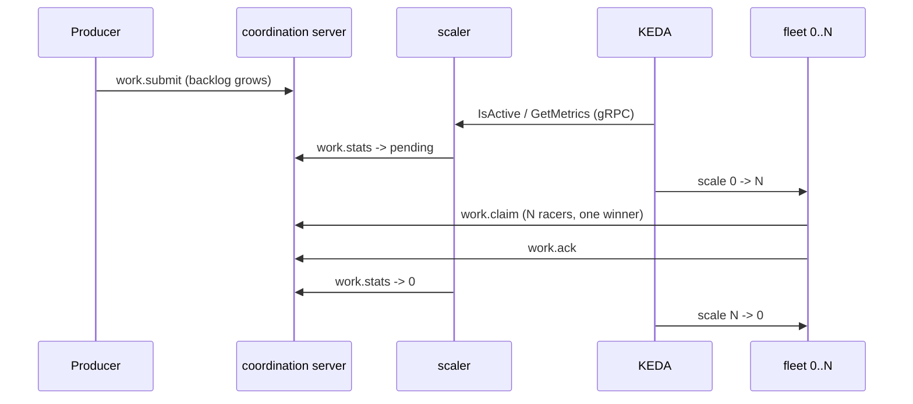
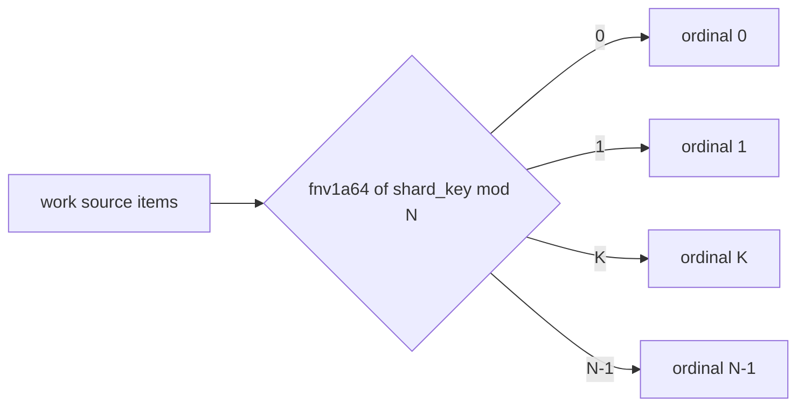

An [`AgentFleet`](/docs/concepts/crds) scales one of two ways. **Claim mode** is
elastic and KEDA-driven; **shard mode** is a fixed, keyed partition. Pick by the
shape of the work.

| | **claim** | **shard** |
|---|---|---|
| Workload | `Deployment` | `StatefulSet` |
| Replicas | KEDA-elastic `0..max` | fixed `N` (operator-owned) |
| Assignment | atomic pull/claim race | `fnv1a64(shard_key) mod N` |
| Ordering | none | same key -> same shard |
| Use for | unordered, elastic pools | keyed / ordered work, stable identity |

## Claim mode — elastic from zero

`scaling.mode: claim` renders a `Deployment` with `.spec.replicas` **omitted** —
KEDA's HPA owns it. The [coordination server](/docs/guides/work) backlog drives
the scale decision, so the fleet can scale **from zero**:

```yaml
spec:
  scaling:
    mode: claim
    min: 0
    max: 10
    target:
      signal: pending_events   # contract-neutral token, mapped to the metrics schema
      value: "5"               # per-replica target KEDA scales toward
```



`scaling.target.signal` is a **contract-neutral** token; the operator maps it onto
the agent's negotiated [metrics schema](/docs/reference/metrics) (e.g.
`agent_pending_events`) — never the branded literal.

## Shard mode — keyed partitions

`scaling.mode: shard` renders a `StatefulSet` with `replicas = scaling.shards`.
KEDA is paused; the partition count `N` is operator-owned. Each replica gets a
`K/N` shard identity from its StatefulSet ordinal (via the
[`AGENT_SHARD` env var](/docs/reference/env-convention)), and the intake predicate
runs **before any claim**, so out-of-shard items drop at near-zero cost:



The same key always lands on the same shard (ordering). Shard composes with claim
for resize overlap. Out-of-shard drops are counted by
`agent_shard_skipped_total`.

## Scale latency

Scale-from-zero latency decomposes into: scaler poll interval + KEDA cooldown +
image pull + agent start. The reference `agentd` image is ~1.3 MB, which keeps the
image-pull term small. See the [operations runbook](/docs/operations) for tuning
and SLOs.

## Next

- [Work distribution](/docs/guides/work) — the `work.*` claim ledger in detail.
- [Observability](/docs/guides/observability) — the scaling signals.
