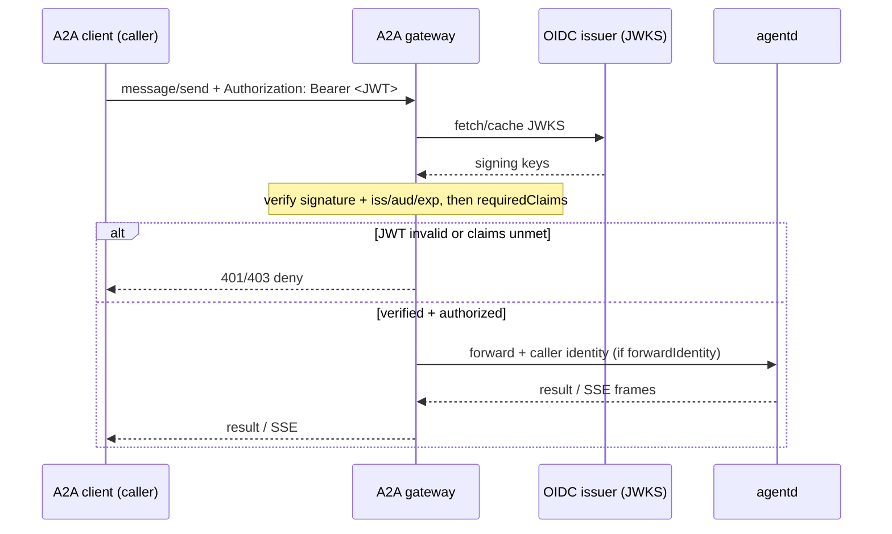

When an [`Agent`](/docs/concepts/crds) (or a fleet `spec.template`) declares
`spec.access.oidc`, the [A2A gateway](/docs/guides/a2a) gates that agent's surface
on a JWKS-verified JWT plus a `requiredClaims` authorization check before
forwarding, and can pass the verified identity to the agent.

Full detail and worked example:
[security model -> OIDC](/docs/security#oidc-per-agentfleet-caller-identity).

## The `spec.access.oidc` block

```yaml
apiVersion: agents.x-k8s.io/v1alpha1
kind: Agent
metadata:
  name: support-bot
spec:
  mode: reactive
  image: ghcr.io/agentd-dev/agentd:1.0.0
  instruction: "serve the management profile"
  access:
    oidc:
      issuer: https://issuer.example.com
      audiences: ["agentctl"]
      forwardIdentity: true
      requiredClaims:
        - claim: groups
          anyOf: ["support"]
```

- **`issuer`** — JWKS is auto-discovered from
  `issuer/.well-known/openid-configuration` unless **`jwksUri`** is set.
- **`audiences`** — accepted `aud` claims.
- **`requiredClaims`** — authorization: **ALL** listed requirements must hold; each
  is satisfied if the caller's claim (array contains, or scalar equals) is one of
  `anyOf`.
- **`forwardIdentity`** — inject the caller's `sub`/`email`/`groups` to the agent.

## How the gateway enforces it



This composes with the coarse [API token](/docs/guides/security/api-token) gate
and with the [trusted front-proxy](/docs/guides/security/trusted-proxy) path
(which can pass `requiredClaims` through from an edge gateway). See
[architecture §7a](/docs/architecture).
